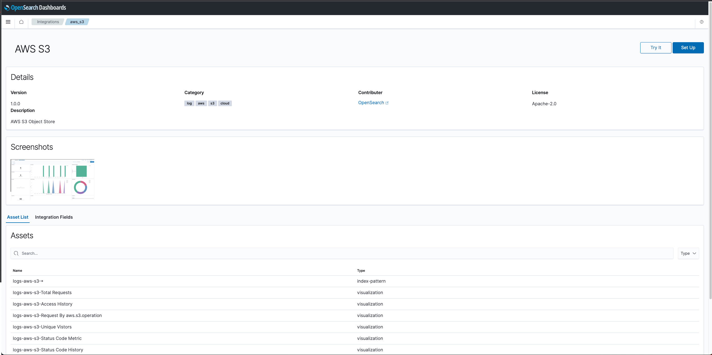
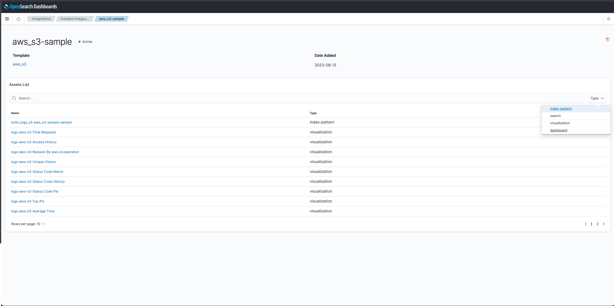
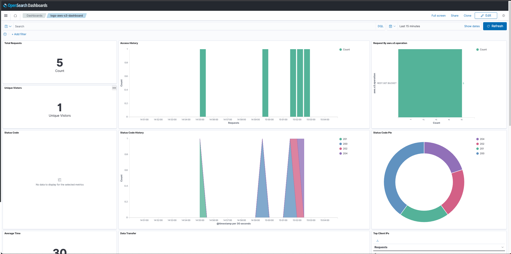

# OpenSearch Integrations

### ***A journey for adding the data aware assets into the user’s workspace.***

The integration initiative was envisioned as a simple, elegant and powerful way to allow users to view,  query and project their data.

The existing way that users could configure their dashboards, for example is to undergo the following process every time:

* Explore their index content and extract the structure - mapping file
* Assemble the index pattern based on this mapping
* Create visualization for different parts of the mapping fields
* Compose the entire dashboard from these visualizations
* Save the dashboard and allow export for other users to utilize (expecting the mapping to be the same)

The repeated bootstrap required for every single index is a log, error-prone and consuming process that requires some degree of knowledge both of the data and of the OpenSearch API.

At OpenSearch we are supporting many different type of use cases for a large variety of users:
- Search related domain use cases - E-commerce products search for example
- Observability monitoring and provisioning - Trace / Metrics analytics
- Security Monitoring and Threats Analysis

All these use cases are accompanied by a very strong and matured community that has contributed many resources and Knowledge to these domain.

One important concept of such contributions are the domain schema used by the data signal collected for such events (security /  observability).

The [Observability OpenTelemetry](https://opentelemetry.io/) is a vibrant and productive community that is constantly developing the monitoring and tracing agenda. The [OTEL protocol](https://opentelemetry.io/docs/specs/otel/) which is a key concept of the OpenTelemetry products allows the consolidation and unification of many types of observed data signals.

At OpenSearch we adopted this protocol and developed the [Simple Schema For Observability](https://github.com/opensearch-project/opensearch-catalog/tree/main/docs/schema/observability) to help manifest these concepts into a concrete index mapping catalog.

Once the schema is in place, the next phase would be to select a list of products / services that are very common is the user’s topology ( databases, web-servers, containers) and to provide our opinionated monitoring dashboards on top of them.

Using the well-defined Observability schema structure simplified the assumptions on the fields names and semantics conventions purposes. It allows us to build a common dashboard that reflects the behavior and provisions the different aspect of the observed resource.

The next part after we build the dashboards was to actually test them with an ingestion pipeline that simulates a real ingestion flow arriving from the user’s system.

We support the following pipeline ingestion:

- [OpenSearch Data-Prepper](https://github.com/opensearch-project/data-prepper)
- [OTEL collector](https://github.com/open-telemetry/opentelemetry-collector)
- [Fluent-Bit](https://docs.fluentbit.io/manual/pipeline/outputs/opensearch)

Each one of these pipelines support the OTEL schema (or directly using the simple schema ) so that they index the signal documents into the [correct index](https://github.com/opensearch-project/opensearch-catalog/blob/main/docs/schema/observability/Naming-convention.md) which represents the Observed resource signals.

Once this was in-place - we continued further and generalized this concept to allow more types of “structure aware assets” that can rely on the mapping structure.

The generalization framework to convey these capabilities is called **integration** and it has the following characteristics:

* Name & description
* Source url & License
* Schema spec (mapping / components mapping)
* Sample data (for try-out experience)
* Assets (Dashboards, Index-Patterns , Queries, Alerts )

[Integration-creation.md](Integration-creation.md) is a process that we are aiming to become a simple task that will allow users and organizations to organize their domain into a well structured set of integrations that reflect their use-cases and their common resources.

---
**Here are some screenshots :**

The next images show the user experience for onboarding the dashboards that reflects his system’s resources using the integration dialogs:

*Selecting the resource to integrate*

*Filtering to a specific schema aspect (cloud based)*

*Review the Aws S3 Observability Integration*

*Trying out the integration using sample data*

*Viewing the main S3 Observability dashboard*

This sample shows how the user can navigate and explore the existing integrations that are bundled with OpenSearch release and select the appropriate resource that are part of its system.

* * *

### Planned ahead

As we continue the evolution of the integration framework we are planning to extend and expand in the following directions

* Adding additional assets to the integrations including
    * Schema based Alerts
    * Saved Search templates (a type of “prepaid statement”)
    * Predefined metrics
    * Datasources for connecting data-lake and external data
    * Industry/standard SLO/SLAs for different services

Adding additional ingestion pipelines specifications (including usage tutorial) for users to take as the basis for their Observability ingestion pipeline definition. This includes both internal ingestion pipelines such as with OpenSearch Ingestion Service, as well as external, such as fluent bit lua convertors.

We are also planning of expanding the scope of the integrations to allow users to define a [“Integration-Catalog”](https://github.com/opensearch-project/dashboards-observability/issues/900). This catalog will enable users to experiment and simplify loading of a group of related integrations ( catalog can represent the services of a cloud provider for example) .

It can also be used for customers to predefine in advance different organizational scopes that will take form in a set of integrations with specific dashboards that match that organization’s business flows and responsibilities.

We are very much in the phase of shaping the future of this important feature and we are hoping that the community will guide us on the next steps.

Please feel free to [participate and contribute](https://github.com/opensearch-project/dashboards-observability/issues/new?assignees=&labels=integration%2C+untriaged&projects=&template=integration_request.md&title=%5BIntegration%5D) so that the next integration will help your organization reach productivity faster and easier .

* * *

### Additional information

#### Integration with OpenTelemetry

OpenTelemetry is a CNCF project designed to generate, collect, and describe telemetry data from distributed systems. The Observability plugin for OpenSearch Dashboards leverages OpenTelemetry's data collection capabilities, allowing users to send data from their applications to OpenSearch.
> For additional information on setting-up OpenTelemetry Collector with OpenSearch see the [OpenTelemetry Demo app](https://github.com/opensearch-project/opentelemetry-demo).

The plugin supports the OpenTelemetry Protocol (OTLP) using the [Simple Schema for Observability ](https://github.com/opensearch-project/opensearch-catalog/tree/main/docs/schema/observability), making it compatible with a wide range of instrumentation libraries and observability tools.

This allows developers to continue using their existing OpenTelemetry-based observability stack, with the added benefit of advanced analytics and visualization capabilities provided by OpenSearch Dashboards.
> For additional information see [OpenSearch OpenTelemetry Example Architecture ](https://github.com/opensearch-project/opentelemetry-demo/blob/main/.github/architecture.md)

---
[Integration RFC](https://github.com/opensearch-project/dashboards-observability/issues/644)
- [Integration Development Tracking](https://github.com/opensearch-project/dashboards-observability/issues/668)
-  [Integration schema catalog](https://github.com/opensearch-project/opensearch-catalog/tree/main/docs/schema)

[ Observability Schema catalog](https://github.com/opensearch-project/opensearch-catalog/tree/main/docs/schema/observability)
- [Simple Schema Semantics](https://github.com/opensearch-project/opensearch-catalog/blob/main/docs/schema/observability/Semantic-Convention.md)
- [Simple Schema index Naming](https://github.com/opensearch-project/opensearch-catalog/blob/main/docs/schema/observability/Naming-convention.md)

- [Integration-creation ](Integration-creation.md)
- [Integration-reference.md](Integration-reference.md)

