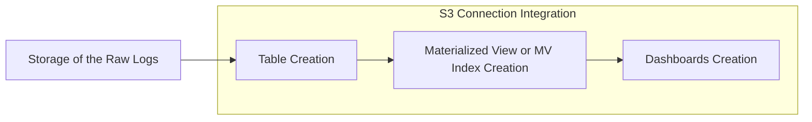
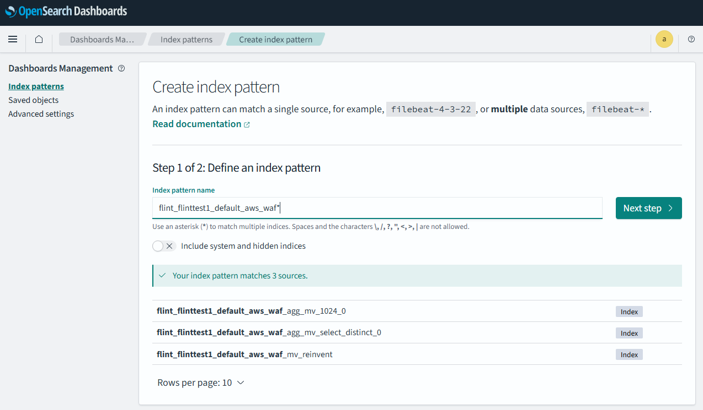
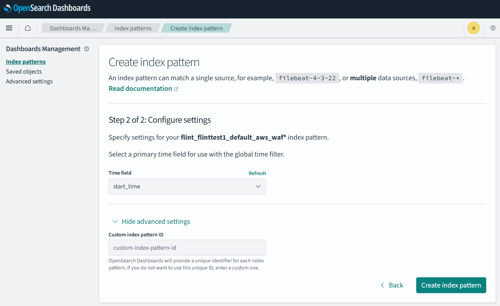
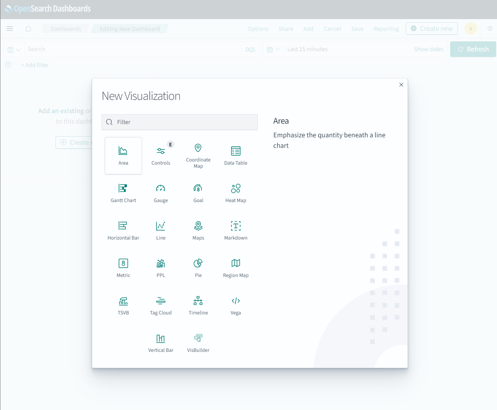
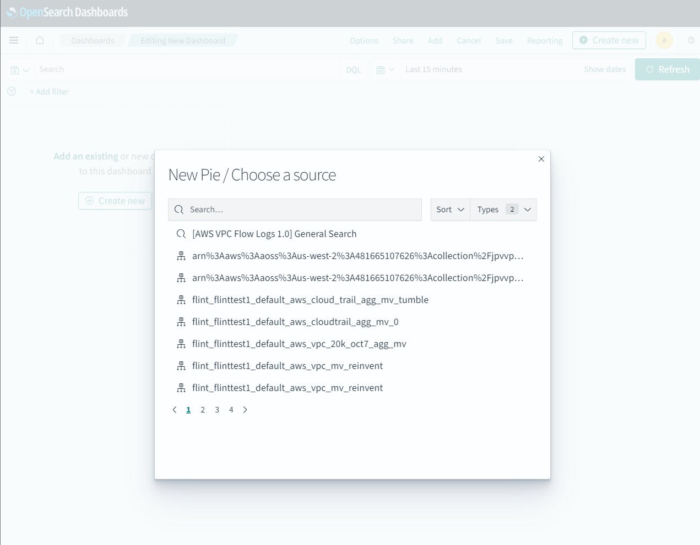
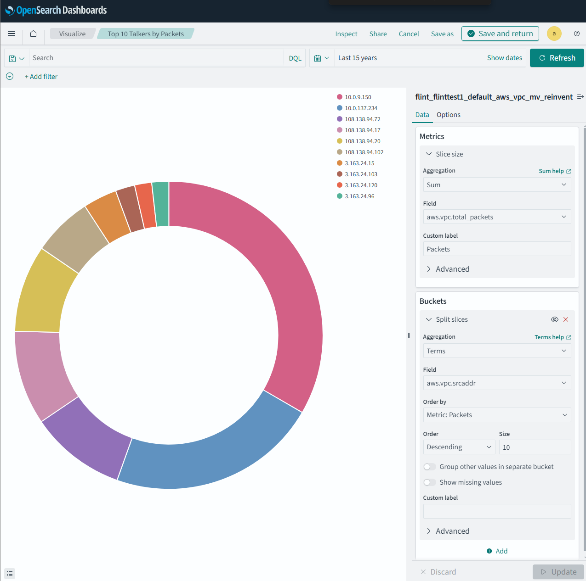
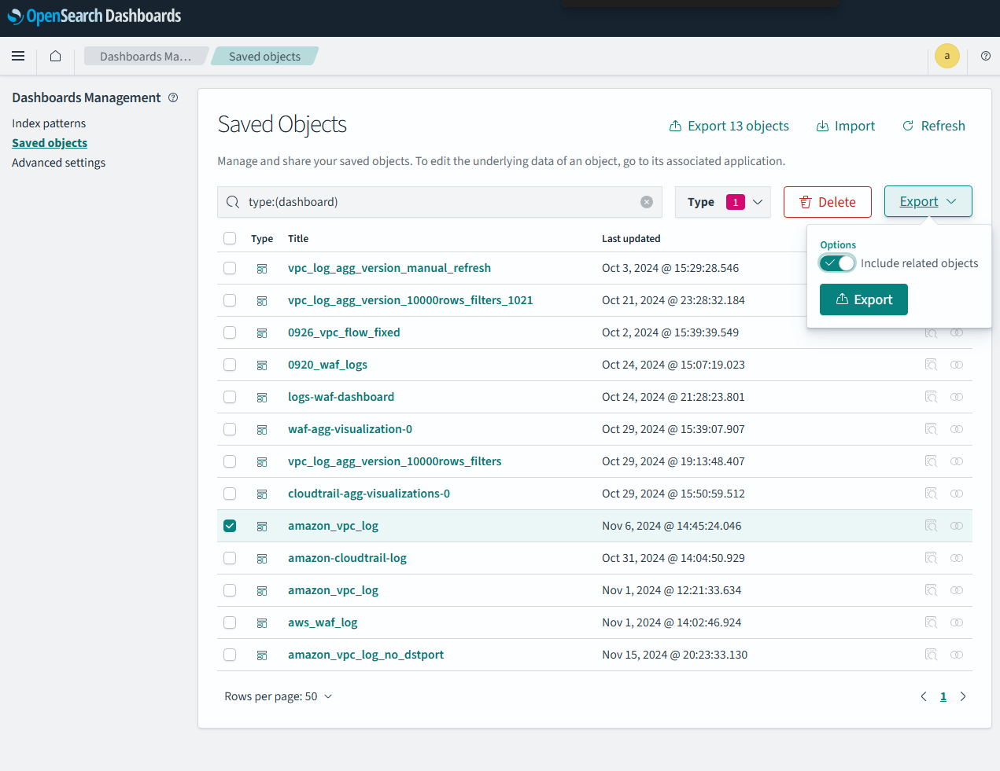
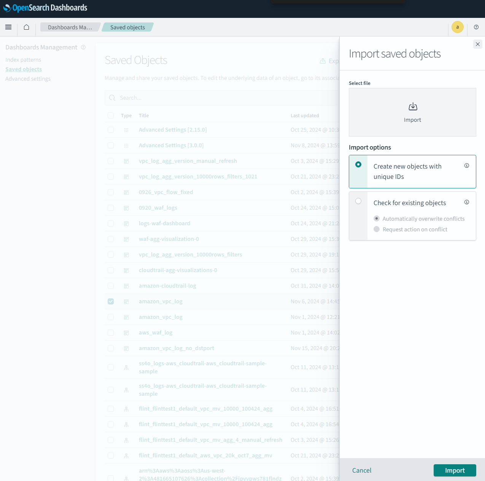

# SOP - OpenSearch Integration Setup

**Date:** Jan 01, 2025

## Introduction

This document serves as a comprehensive guide for developers or users who are responsible for creating custom OpenSearch integrations and dashboards within their organization. Whether you're developing new materialized view indices, building custom visualizations, or setting up end-to-end data pipelines, this guide will walk you through the essential steps and best practices. It outlines the key steps involved in the integration process and provides detailed instructions for creating and managing materialized views, as well as building and utilizing DQL visualizations. Additionally, it highlights common scenarios and challenges that users may encounter during these tasks, offering practical solutions and debugging strategies to address them effectively. By following this guide, users can streamline their workflows and ensure a smooth integration experience with OpenSearch.

## How OpenSearch Integration Works

The integration process typically follows these sequential steps:

- Storage of the Raw Logs: Collect and store raw log data in a designated location.
- Table Creation: Transform the raw log data into structured tables for processing.
- Materialized View (MV) or MV Index Creation: Create materialized views to aggregate and index the data for easier querying and analysis.
- Dashboard Creation: Use the MV index to build dashboards that visualize and analyze the data effectively.



## Integration of S3 Connection in OpenSearch

### S3 Connection Integration

As the name implies, this type uses an S3 bucket to store raw log data. The integration setup strictly follows all the steps outlined above, beginning with raw log storage and proceeding through table creation, materialized view creation, and dashboard configuration.

- When to Use: Choose this type if your raw logs are stored in S3 buckets and require processing from the ground up.
- Key Note: Ensure proper IAM permissions are configured for OpenSearch to access and process the data from your S3 bucket.

## General Principles of OpenSearch Integration
Before diving into the detailed steps of the integration process, it is important to understand some general principles that govern the flow. These principles ensure seamless functionality across the integration, from table creation to dashboard visualization.

**1. Field Name Matching in Table and Materialized View (MV) Queries**

- The fields in the table used for the integration must match the field names specified in the `SELECT` section of the MV creation query.

**2. Table Name Alignment with MV Queries**

- The table name must match the table referenced in the MV creation query’s FROM clause.

**3. MV Index Field Name Consistency with Dashboards**

- The fields in the MV index must align with the field names referenced in the dashboards’ `.ndjson` visualization files.

**4. Index Name/Pattern in `.ndjson`**

- The `.ndjson` visualization file for dashboards must include the index name or index pattern associated with the MV index.

### Consequences of Mismatched Configurations

Any mismatch in the above elements can lead to:

- **Empty Results**: The MV index or dashboards may return no data.
- **Visualization Failures**: Dashboards may fail to render properly due to missing fields or incorrect index patterns.
- **MV Creation Failures**: The MV creation process itself may fail if table or field names do not align correctly.

## Table Creation

### Overview

For the S3 Integration Setup, table creation is a critical first step in structuring your raw data into a usable format for downstream processing.

### Table Creation Query

To create a table, you need to define the schema that aligns with the structure of your raw data. This ensures consistency and compatibility across the entire integration pipeline. Below is an example query for creating a table to process VPC flow logs:

```sql
CREATE EXTERNAL TABLE IF NOT EXISTS {table_name} (
    version int,
    accountId string,
    interfaceId string,
    srcAddr string,
    dstAddr string,
    srcPort int,
    dstPort int,
    protocol bigint,
    packets bigint,
    bytes bigint,
    start bigint,
    `end` bigint,
    action string,
    logStatus string
)
USING csv
OPTIONS (
  sep=' ',
  recursiveFileLookup='true'
)
LOCATION '{s3_bucket_location}'
```

### Explanation of the Query

**1. Table Definition**

- `CREATE EXTERNAL TABLE`:
  - Indicates that this is an external table, meaning the data resides outside the database, such as in an S3 bucket.
  - The table will reference the data at the specified location without importing it into the database.
- `IF NOT EXISTS`:
  - Ensures the table is created only if it does not already exist, preventing accidental overwrites.
- `{table_name}`
  - Placeholder for the table's name, which should clearly describe the data it represents (e.g., vpc_flow_logs).

**2. Column Definitions**

Each column in the table must match the fields in your raw data. For example the above query matches the raw log like this:

```
2 481665107626 eni-0e52602be7b6a5fb0 4.151.38.185 10.0.9.150 36869 5984 6 1 40 1727472823 1727472846 ACCEPT OK
```

**3. Storage Type**

- `USING csv`: Specifies that the data format is CSV. Update this if your data is in another format (e.g., JSON or Parquet).

**4. Options**

- `sep=' '`: Indicates that fields in the CSV are separated by spaces. Adjust this based on your data delimiter.
- `recursiveFileLookup='true'`: Enables the system to recursively search through subdirectories in the specified location.

**5. Data Location**
- `LOCATION '{s3_bucket_location}'`: Specifies the S3 bucket path where the raw log files are stored. Replace `{s3_bucket_location}` with your actual S3 path.


### Key Principle

The **table schema must match the raw data fields exactly**. Any mismatch will result in:
- Errors during table creation or query execution.
- Incorrect data processing or empty results downstream.

### Validation

After creating the table, validate the schema and data integrity:

1. Run a simple query to inspect the data (This can be done in query workbench by selecting the correct datasource -> database):

```sql
SELECT * FROM {datasource_name}.{database_name}.{table_name} LIMIT 10;
```

2. Ensure that the data aligns with the schema (e.g., no null values in mandatory fields, correct data types)

### Troubleshooting Common Issues

**1. Mismatch Between Schema and Raw Data:**

- Double-check the raw data structure and update the table schema accordingly.

**2. File Format Issues:**

- Ensure the specified file format (`csv`, `json`, etc.) matches the raw data format.
- Verify that the delimiter in the `OPTIONS` section aligns with the actual file separator.

**3. Permission Errors:**
- Confirm that OpenSearch has proper permissions to access the S3 bucket

## Materialized View (MV) Creation

Materialized Views (MVs) play a critical role in optimizing query performance by pre-aggregating data into a format ready for analysis. The key principle is ensuring that the `SELECT` section of the MV query aligns precisely with the actual table columns.

### Full Index Query vs. Aggregated Query in Materialized Views

When creating a Materialized View (MV) in OpenSearch, it is important to decide whether the index should contain the full details of the raw data or an aggregated version of the data. This choice depends on your use case, the type of analysis you plan to perform, and the trade-offs between data accuracy and storage efficiency.

**1. Full Index Query**  
A full index query fetches every row from the raw data without applying any aggregation. Each field in the raw table is represented as-is in the MV index, providing a highly detailed and accurate copy of the source data.

**Example Query:**
```sql
CREATE MATERIALIZED VIEW {materialized_view_name} AS
  SELECT
    CAST(IFNULL(srcPort, 0) AS LONG) AS `aws.vpc.srcport`,
    CAST(IFNULL(srcAddr, '0.0.0.0') AS STRING) AS `aws.vpc.srcaddr`,
    CAST(IFNULL(interfaceId, 'Unknown') AS STRING) AS `aws.vpc.src-interface_uid`,
    CAST(IFNULL(dstPort, 0) AS LONG) AS `aws.vpc.dstport`,
    CAST(IFNULL(dstAddr, '0.0.0.0') AS STRING) AS `aws.vpc.dstaddr`,
    CAST(IFNULL(packets, 0) AS LONG) AS `aws.vpc.packets`,
    CAST(IFNULL(bytes, 0) AS LONG) AS `aws.vpc.bytes`,
    CAST(FROM_UNIXTIME(start) AS TIMESTAMP) AS `@timestamp`,
    CAST(FROM_UNIXTIME(start) AS TIMESTAMP) AS `start_time`,
    CAST(FROM_UNIXTIME(start) AS TIMESTAMP) AS `interval_start_time`,
    CAST(FROM_UNIXTIME(`end`) AS TIMESTAMP) AS `end_time`,
    CAST(IFNULL(logStatus, 'Unknown') AS STRING) AS `aws.vpc.status_code`,
    CAST(IFNULL(action, 'Unknown') AS STRING) AS `aws.vpc.action`,
    CAST(IFNULL(accountId, 'Unknown') AS STRING) AS `aws.vpc.account-id`
  FROM
    {table_name}
WITH (
  auto_refresh = true,
  refresh_interval = '15 Minute',
  checkpoint_location = '{s3_checkpoint_location}',
  watermark_delay = '1 Minute',
  extra_options = '{ "{table_name}": { "maxFilesPerTrigger": "10" }}'
)
```

**Advantages:**
- Provides a detailed, row-by-row copy of the raw data.
- Ensures complete accuracy by preserving all information from the source.

**Disadvantages:**
- Results in a larger MV index size, which can consume significant storage.
- May increase query execution time if the MV index contains a large volume of data.

**2. Aggregated Query**  
An aggregated query groups data by specific dimensions and applies metrics like sums, counts, or averages to create a summarized view of the raw data. This reduces the size of the MV index while retaining the most relevant insights.

**Example Query:**
```sql
CREATE MATERIALIZED VIEW {materialized_view_name}
AS
SELECT
  TUMBLE(`@timestamp`, '5 Minute').start AS `start_time`,
  action AS `aws.vpc.action`,
  srcAddr AS `aws.vpc.srcaddr`,
  dstAddr AS `aws.vpc.dstaddr`,
  protocol AS `aws.vpc.protocol`,
  dstPort AS `aws.vpc.dstport`,
  COUNT(*) AS `aws.vpc.total_count`,
  SUM(bytes) / 1048576 AS `aws.vpc.total_bytes`,
  SUM(packets) AS `aws.vpc.total_packets`
FROM (
  SELECT
    action,
    srcAddr,
    dstAddr,
    bytes,
    packets,
    protocol,
    dstPort,
    CAST(FROM_UNIXTIME(start) AS TIMESTAMP) AS `@timestamp`
  FROM
    {table_name}
)
GROUP BY
  TUMBLE(`@timestamp`, '5 Minute'),
  action,
  srcAddr,
  dstAddr,
  protocol,
  dstPort
WITH (
  auto_refresh = true,
  refresh_interval = '15 Minute',
  watermark_delay = '1 Minute',
  checkpoint_location = '{s3_checkpoint_location}'
)
```

**Advantages:**  
- Significantly reduces the MV index size, saving storage space and improving query performance.
- Suitable for use cases that involve analyzing trends or patterns over time.

**Disadvantages:**
- May lose some detail by omitting data points that fall outside of the aggregation window.
- Aggregated metrics may introduce inaccuracies in certain edge cases.

**Important Note :** Aggregated Materialized Views work well for summarizing data but may not be suitable for high-cardinality fields. High-cardinality fields, such as unique user IDs or IP addresses with numerous distinct values, can result in excessively large indices or performance issues. In such cases, a full index query may be a better choice to retain all details.

### Recommendations for Choosing an Approach

**Use a Full Index Query If:**
- You need to retain all raw data for detailed analysis or auditing.
- The volume of raw data is manageable, and storage is not a primary concern.
- Your use case involves querying data at a granular level without summarization.

**Use an Aggregated Query If:**
- **High-cardinality fields are not critical to your analysis.** Aggregated queries may not perform well or could result in excessively large indices when working with high-cardinality fields (e.g., unique user IDs, IP addresses).
- Storage efficiency is critical, and you want to minimize the size of the MV index.
- You are analyzing trends, generating reports, or visualizing data over time.
- Some loss of granularity is acceptable in exchange for improved query performance.

By carefully evaluating your data requirements and balancing accuracy against storage and performance, you can select the most appropriate MV creation strategy for your use case.

### Construction of a MV Creation Query

The following instructions are based on the **aggregated version of the MV query**, as it involves additional complexity compared to the full index query. While the full index query simply includes all fields without any aggregation, the aggregated version requires defining specific metrics and grouping data based on your analysis needs.

### Index Fields Naming Conventions

1. Use Dot-Notation for Hierarchical Fields  
Represent nested structures using dot-separated notation.  
Example: `aws.vpc.srcaddr` for `srcAddr` under the `vpc` namespace.

2. Use Descriptive Prefixes for Namespacing  
Prefix field names with a relevant category or namespace to avoid field name collisions.  
Example: Use `aws.vpc` as a prefix for VPC flow log fields.

3. Avoid Reserved Keywords  
Ensure that field names do not conflict with SQL or OpenSearch reserved keywords (e.g., avoid select, from, timestamp).

4. Consistent Abbreviations and Units  
Standardize abbreviations (e.g., src for source, dst for destination).  
Include units where applicable, such as total_bytes (in bytes) or total_mb (in megabytes).

**Examples of Naming Conventions in Action**
- Table Field: `srcAddr`
- Mapped Field in MV: `aws.vpc.srcaddr`
- Dashboard Reference: `aws.vpc.srcaddr`

### Explanation of the Query

Please reference to the [documentation link](https://github.com/opensearch-project/opensearch-spark/blob/main/docs/index.md) of OpenSearch Spark GitHub Repository

### Key Principle

**1. Field Mapping Consistency:**

- The inner `SELECT` section of the MV query must match the column names in the source table.

**2. Proper Time Windowing:**

- Use appropriate time windows (e.g., 1 minute, 5 minutes) based on the use case and data frequency.

**3. Efficient Aggregation:**

- Aggregate only the fields required for downstream analysis to reduce computation overhead.


### Validation

Proper validation ensures that the Materialized View (MV) index has been created correctly and that it contains the expected data. This can be done from an index perspective using the **Dev Tools** in OpenSearch Dashboards. Follow these steps:

**1. Verify MV Index Creation**

Use the `GET` command to search the newly created index by its full name
```
GET flint_{datasource_name}_{database_name}_{user_given_flint_asset_name}_{flint_index_type}/_search
```
and here is an example:

```
GET flint_flinttest1_default_vpc_mv_10000_100424_agg_mv/_search
```

**2. Check Index Mapping**

Validate the schema (field names and types) of the MV index to ensure it aligns with the Materialized View query. Use the `_mapping` endpoint:

```
GET flint_flinttest1_default_vpc_mv_10000_100424_agg/_mapping
```

### Troubleshooting Common Issues

This section provide a general guidance of trouble shooting, however, for more detailed information about Materialized View and other flint index, please reference to the [documentation in OpenSearch Spark GitHub repository](https://github.com/opensearch-project/opensearch-spark/blob/main/docs/index.md)

**1. Mismatch Between MV Query and Table Fields:**

- Ensure that the columns in the inner `SELECT` statement match those in the table schema.
- For verify the query correctness, user can also query the data first in query workbench without an actual creation of MV and MV index by only using the `SELECT` section

**2. Incorrect Time Aggregation:**

- Verify the time column (`@timestamp`) and the time window (`TUMBLE`) settings.

**3. Refresh Failure**

- Check the `auto_refresh` and `refresh_interval` settings.
- For verify the query correctness, manual refresh index is also an option. User can also create manual refresh materialized view by ignoring the entire `WITH` section and iniate a manual refresh in query workbench to populate the data in: 

```
REFRESH MATERIALIZED VIEW {mv_name}
```

**4. Missing or Inconsistent Data:**

- Verify that late-arriving data is handled by adjusting `watermark_delay`.

**5. Query Execution Failures:**

- OpenSearch provides detailed query execution logs in the `query_execution_result_{datasource_name}` index.
- Users can diagnose failures by querying these logs with the `queryId` using the Dev Tools. For example:

```
GET query_execution_result_{datasource_name}/_search
{
  "query": {
    "match": {
      "queryId": "{queryId}"
    }
  }
}
```
- Usually, the `queryId` can be found in the response body of the query request

## Dashboards Creation

As mentioned earlier, dashboards in OpenSearch rely on the MV index created in the previous steps. The fields within the MV index are used to construct DQL (Domain Query Language) queries, which in turn form the basis of visualizations and panels.

### Step-by-Step Guide to Dashboards Creation

**1. Understand the MV Index Structure**

- Use the `_mapping` endpoint to verify the schema of the MV index:

```
GET flint_{datasource_name}_{database_name}_{user_given_flint_asset_name}_{flint_index_type}/_mapping
```

- Confirm that all required fields are indexed and appropriately typed (e.g., `keyword`, `text`, `numeric`).


**2. Create a New Index Pattern in OpenSearch Dashboards**

- Navigate to **Dashboards Management → Index Patterns** (https://{dashboards_base_url}/_dashboards/app/management/opensearch-dashboards/indexPatterns) in OpenSearch Dashboards.
- Click Create Index Pattern.
- Enter the full name of your MV index (e.g., `flint_flinttest1_default_vpc_mv_10000_100424_agg`) or a matching pattern.

- Select the appropriate time field (e.g., @timestamp) for time-based visualizations.

- Save the index pattern.

**3. Create and Configure Dashboards with Visualizations**

- Navigate to the **Dashboards** section in OpenSearch Dashboards.
- Click Create Dashboard to start building a new dashboard.
  - **Use the Visualization UI**: OpenSearch Dashboards provides a user-friendly interface for creating visualizations. Follow these steps to configure your visualizations:
    1. **Select the Type of Visualization**: Choose from options like bar chart, pie chart, line chart, or metrics. The type depends on how you want to display your data.
    
    2. **Select the MV Index Pattern**: From the dropdown, select the index pattern linked to your MV index.
    
    3. Add the Required Fields:s
        - Use the interface to add fields from your index.
        - Specify how you want to aggregate the fields (e.g., Count, Sum, Average, etc.).
        - Configure additional filters or groupings as needed.  
        
    4. **Preview the Visualization**: The UI provides a real-time preview of your visualization. Adjust fields, filters, or aggregations if necessary to refine the output.
  - Save the visualization once satisfied with the configuration.
- Add the visualization to your dashboard and arrange it alongside others to create a logical layout.

**4. Export and Import Visualizations Using `.ndjson` Files**

This feature allows users to bypass manual configuration by reusing pre-configured templates.

- Since the visualizations created in OpenSearch Dashboards are saved objects, they can be exported and reused.
- **Exporting Visualizations**:
  - Navigate to **Dashboards Management → Saved Objects**.
  - Search for the visualization or dashboard you want to export.
  - Select the desired objects and click Export to download the `.ndjson` file.
  
- **Importing Visualizations**:
  - Navigate to **Dashboards Management → Saved Objects**.
  - Click Import and upload the `.ndjson` file.
  - Resolve any conflicts (e.g., index pattern mismatches) during the import process.
  - The imported visualizations will now be available in the Visualize and Dashboards sections.
  

### Troubleshooting Common Issues

**1. Missing Data in Visualizations**

- The MV index is not fully populated or has incorrect data.
- Query the MV index directly to ensure it contains the expected data
- Check if the index pattern includes the correct time field (e.g., @timestamp) and ensure the dashboard time range covers the available data.

**2. Visualization Not Displaying Results**

- Incorrect DQL queries or filters can lead to this.
- Verify the DQL query used in the visualization.
- Ensure all required fields are present in the MV index and properly mapped.

**3. Import Errors for .ndjson Files**

- Conflicts in index patterns or missing dependencies.
- During import, resolve conflicts by mapping the `.ndjson` index pattern to an existing one.
- Ensure that required index patterns are created before importing visualizations.

## Publish to OpenSearch Catalog Repository

Once the integration has been validated and confirmed to function correctly, the final step is to share your work with a broader audience or make it accessible for reuse within your organization or community. Publishing your integration involves uploading the associated files and documentation to the OpenSearch Catalog GitHub repository, ensuring that other developers or teams can benefit from your efforts. This section provides a high-level guide to preparing, uploading, and publishing your integration.

Preparing for Publication

**1. Organize Your Assets:**

  - Ensure all relevant files are properly structured and clearly named, including:
    - Materialized View Queries: Save queries in a .sql file for easy reference.
    - .ndjson Files: Include all visualization and dashboard files.
    - Integration Documentation: Provide a README describing the integration setup, use case, and troubleshooting tips. Here is an example for an existing version of [Amazon CloudFront Integration’s README.md in OpenSearch Catalog Repo](https://github.com/opensearch-project/opensearch-catalog/blob/main/integrations/observability/amazon_cloudfront/README.md).

**2. Include Metadata:**

  - Add descriptive metadata for your integratio
    - Integration Name: A clear and concise name (e.g., "S3 VPC Flow Logs Dashboard").
    - Purpose: A brief explanation of the integration’s functionality.
    - Requirements: Specify dependencies such as OpenSearch version, permissions, and data formats.

**3. Perform a Final Validation:**

  - Test the integration end-to-end to confirm all components (e.g., dashboards, queries, indices) work as expected.

For detailed instructions on how to upload and manage integrations in the OpenSearch Catalog, please refer to the [OpenSearch Catalog Integration Documentation](https://github.com/opensearch-project/opensearch-catalog/blob/main/docs/integrations/README.md).

## Reference

- Creating Dashboards in OpenSearch: https://opensearch.org/docs/latest/dashboards/dashboard/index/
- Flint Assets in OpenSearch Spark: https://github.com/opensearch-project/opensearch-spark/blob/main/docs/index.md
- Documentation of Integrations in OpenSearch Dashboards: https://opensearch.org/docs/latest/integrations/
- Guidance of Publish OpenSearch Integration Assets: https://github.com/opensearch-project/opensearch-catalog/blob/main/docs/integrations/README.md
