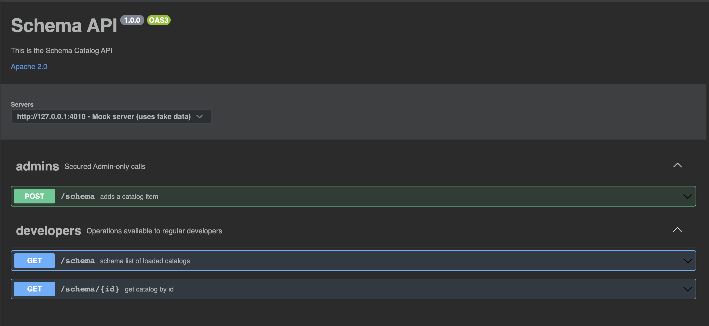

# API elements
The catalog/schema API exposes the capability to express the domain entities structure.
Domain entities are a logical representation of the underlying index mapping that reflects the actual physical structure.
As detailed in the [README](../README.md) document, the catalog (schema) is a unification of entities that share a domain contextual relationship.

For Observability - the domain is composed out of 3 distinct entities (pronounced signals in the open telemetry terminology)
 - Traces
 - Logs
 - Metrics

Each one represents a sub-graph of components (entities) which relate to one another in a specific manner.

The following API will allow to query and understand:
 - the graph hierarchy within the schema
 - the attribute dictionary for each entity
 - the actual instances physically created from the schema templates


## Schema

The `/schema` endpoint will return all the domain specific catalogs stored within the cluster.
The `/schema/{id}` endpoint will return a specific domain catalog stored within the cluster.

### Schema Structure
The schema structure contains both the compositional classes that are part of the specific schema (categories, components, fields)
For additional information see [README](../README.md)

**Examples**

- The [catalogs schema](../system/catalog.schema)
- The [catalogs instance example](../system/samples/catalog.json)


## Dictionary

The `/schema/{id}/dictionary` endpoint will return a specific domain catalog dictionary of fields and attributes encapsulated within this schema

Its also possible to filter the dictionary according to any of the following categories:
 - category : `GET /schema/Observability/dictionary?category=logs`
 - component: `GET /schema/Observability/dictionary?component=http`
 - name: `GET /schema/Observability/dictionary?field=response*`
 - mixture:  `GET /schema/Observability/dictionary?category=traces&component=services`

**Examples**

- The [dictionary schema](../system/dictionary.schema)
- The [dictionary instance example](../system/samples/dictionary.json)

## Instances

The `/schema/{id}/instances` endpoint will return a specific domain list of instances which include all the domain's components that have been created using the schema's templates

 - Indices (created using index mapping templates)
 - DataStreams (created using index mapping templates)
 - DataSource (created and associated with mapping templates)


**Examples**

- The [instances schema](../system/instances.schema)
- The [instances example](../system/samples/instances.json)

---

_This concept was inspired from the [OCSF](https://schema.ocsf.io/) schema model and [swagger](https://schema.ocsf.io/doc/index.html#/)_ 

---

## API Mock Tests
The [Swagger](swagger.yaml) describes the API used by the Integration repository to support the `catalog`, `registry` and `store` functionalities.

Its possible to visualize the REST API using any on the numerous [online editors](https://editor.swagger.io/)


### Setup mock server
In order to test the API, we can utilize a swagger based mock library which allows ['contract based testing'](https://github.com/stoplightio/prism).

#### running the swagger mock server
````
npm install -g @stoplight/prism-cli
````
Once this tool is installed, the server can be run using the next command 
```
prism mock swagger.yaml
```
The next endpoints are presented:
```
[10:32:12 a.m.] › [CLI] ℹ  info      GET        http://127.0.0.1:4010/schema?limit=41
[10:32:12 a.m.] › [CLI] ℹ  info      POST       http://127.0.0.1:4010/schema
[10:32:12 a.m.] › [CLI] ℹ  info      GET        http://127.0.0.1:4010/schema/sed
[10:32:12 a.m.] › [CLI] ℹ  info      GET        http://127.0.0.1:4010/repository?limit=%5Bobject%20Object%5D
[10:32:12 a.m.] › [CLI] ℹ  info      POST       http://127.0.0.1:4010/repository
[10:32:12 a.m.] › [CLI] ℹ  info      GET        http://127.0.0.1:4010/repository/%5Bobject%20Object%5D
[10:32:12 a.m.] › [CLI] ℹ  info      GET        http://127.0.0.1:4010/store?limit=25
[10:32:12 a.m.] › [CLI] ℹ  info      POST       http://127.0.0.1:4010/store
[10:32:12 a.m.] › [CLI] ℹ  info      GET        http://127.0.0.1:4010/store/cum
[10:32:12 a.m.] › [CLI] ℹ  info      POST       http://127.0.0.1:4010/store/nihil/validate
[10:32:12 a.m.] › [CLI] ℹ  info      POST       http://127.0.0.1:4010/store/laudantium/upload
[10:32:12 a.m.] › [CLI] ℹ  info      PUT        http://127.0.0.1:4010/store/nihil/activate
[10:32:12 a.m.] › [CLI] ▶  start     Prism is listening on http://127.0.0.1:4010
```

Once the server has started, a CURL request can be initiated with any of the above endpoints:

`GET http://localhost:4010/schema`

Would show in the traffic logs:

`[10:32:23 a.m.] › [HTTP SERVER] get /schema ℹ  info      Request received`

And will result with :

```json5
    {
  "catalog": "observability",
  "version": "1.0",
  "url": "https://github.com/opensearch-project/opensearch-catalog/tree/main/schema/observability",
  "categories": [
    {
      "category": "logs",
      "version": "1.0",
      "url": "https://github.com/opensearch-project/opensearch-catalog/tree/main/schema/observability/logs",
      "components": [
        {
          "component": "log",
          "version": "1.0",
          "url": "https://github.com/opensearch-project/opensearch-catalog/tree/main/schema/observability/logs/logs",
          "container": true,
          "tags": []
        },
        {
          "component": "http",
          "version": "1.0",
          "url": "https://github.com/opensearch-project/opensearch-catalog/tree/main/schema/observability/logs/http",
          "tags": [],
          "container": false
        },
        {
          "component": "communication",
          "version": "1.0",
          "url": "https://github.com/opensearch-project/opensearch-catalog/tree/main/schema/observability/logs/communication",
          "tags": ["web"],
          "container": false
        }]
    },
    {
      "category": "traces",
      "version": "1.0",
      "url": "https://github.com/opensearch-project/opensearch-catalog/tree/main/schema/observability/traces",
      "components": [
        {
          "component": "span",
          "version": "1.0",
          "url": "https://github.com/opensearch-project/opensearch-catalog/tree/main/schema/observability/traces/traces",
          "tags": [],
          "container": true
        }]
    },
    {
      "category": "metrics",
      "version": "1.0",
      "url": "https://github.com/opensearch-project/opensearch-catalog/tree/main/schema/observability/metrics",
      "components": [
        {
          "component": "metric",
          "version": "1.0",
          "url": "https://github.com/opensearch-project/opensearch-catalog/tree/main/schema/observability/metrics/metrics",
          "tags": [],
          "container": true
        }]
    }
  ]
}
```


####  running the swagger mock server as docker

One-liner docker command (assuming running from repository root):

```text
docker run -p 9200:4010 -v "$(pwd)/docs/API:/api" -v "$(pwd)/schema:/schema" --name integ-prism -t stoplight/prism mock -h 0.0.0.0 /api/swagger.yaml
```