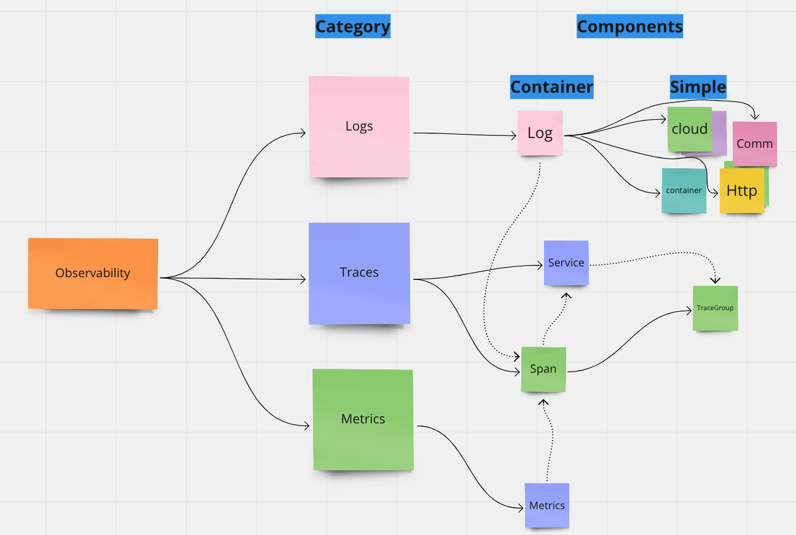
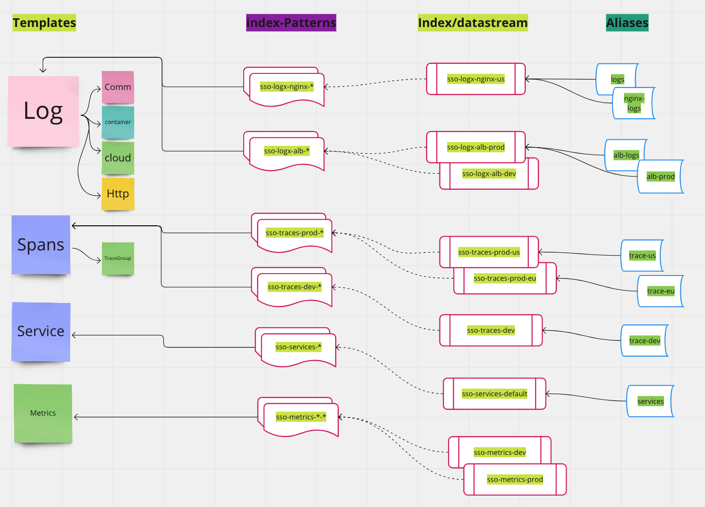

# Schema Instantiation 
A schema is actually a template of a logical structure representing some domain. The domain may have multiple entities and have relations between them but
without the actual Instantiation of the logical schema into real world objects it will only remain a logical template.

When we introduce the Observability schema, we actually refer to the physical [indices](https://opensearch.org/docs/latest/im-plugin/index/) and [datastreams](https://opensearch.org/docs/latest/im-plugin/data-streams/) that contain the observability signals.

The signal data is manifested as a json document inside the index - which follows a specific mapping.

## Physical schema
As we discussed earlier, each logical schema has an equivalent physical schema which define its actual structure inside the OpenSearch storage.

In OpenSearch we have the next physical structures:
 - [Index templates](https://opensearch.org/docs/latest/im-plugin/index-templates/)

Index templates let you initialize new indexes with predefined mappings and settings. They are used to create a template for both indices that will use the structures mapping fields composition and definition
to manifest the logical entities.

 - [Component template](https://opensearch.org/docs/latest/dashboards/im-dashboards/component-templates/)

Component templates allow you to create a single index pattern that matches multiple indexes. This pattern can include wildcards or regular expressions, enabling you to apply the same setting or mapping to multiple indexes simultaneously.

Component template - according to the logical schema definition, corresponds to a non-container component and can be used to compose a combined logical 


## Logical to Physical

According to the logical schema definition - we have 3 layers of logical concepts:

 - **Catalog / Schema** - This is the domain collection of graph elements that define the interactions inside and between the entities 

 - **Category** - This is a sub-graph of elements from the entire catalog graph which defined a specific purposed categorized entities.

 - **Component** - This is the lowest level which infers a single domain entity 

Components have two types:

- **simple component** which represent a low level entity - an entity which is not directly materialized in the database but rather is encapsulated within the "containing" component. 

- **container component** which represent a hyper-graph entity - an entity which may hide a sub-graph of simpler components inside it - this usually corresponds to an index template which may have inner nested object within the single index thus representing a sub-graph of logical elements.

The physical elements contain only 2 layers which are the

 - [Index templates](https://opensearch.org/docs/latest/im-plugin/index-templates/)

This template represents the **container component** which may contain more than one single logical entity 

 - [Component template](https://opensearch.org/docs/latest/dashboards/im-dashboards/component-templates/)

A component template corresponds to a component which is a simple logical entity which may not always have a direct index template representing it 


## Instantiation a schema

Instantiation the schema is the process of taking the index templates and generating the actual indices / datastreams to store the domain entities.

**_We assume here that all the corresponding physical schema template elements have already been created_**

**The Observability catalog** - for example, is composed of 3 categories ( logs, traces, metrics). 

The logical concept of **category** has no explicit physical existence in the OpenSearch database.

It is being implicitly defined in the following way:

- index template name has the [naming convention](observability/Naming-convention.md) that implies its category

- index template `_meta` section which gives extra metadata: 
```json5 "_meta": {
    ...
    "description": "Observability Metrics Mapping Template",
    "catalog": "observability",
    "type": "metrics",
    "correlations" : [
      {
        "field": "spanId",
        "foreign-schema" : "traces",
        "foreign-field" : "spanId"
      },
      {
        "field": "traceId",
        "foreign-schema" : "traces",
        "foreign-field" : "traceId"
      }
    ]
  }

```

The logical concept of **component** has an explicit type which is depended on whether its a container (index-template) or simple (component-template) component.

- [Logs](../../schema/observability/logs/logs.mapping) - is a container component and therefore has an index template 
- [Http](../../schema/observability/logs/http.mapping) - is a simple component and therefore has a component template 
- [Cloud](../../schema/observability/logs/cloud.mapping) - is a simple component and therefore has a component template 




The process of Instantiation starts from the [schema's catalog](../../schema/observability/catalog.json) and going over each category

Each category has a list of Components - for all the container components the appropriate index / datastream is created.


