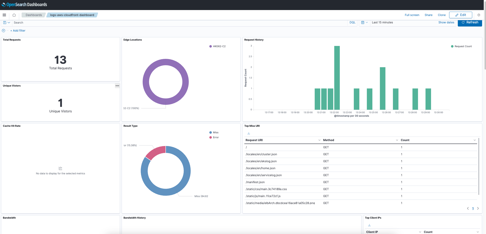

# AWS CloudFront Integration

## What is AWS CloudFront?

Amazon CloudFront is a fast content delivery network (CDN) service that securely delivers data, videos, applications, and APIs to customers globally with low latency and high transfer speeds. CloudFront is integrated with other Amazon Web Services products to give developers and businesses an easy way to distribute content to end-users with low latency and high data transfer speeds.

See additional details [here](https://aws.amazon.com/cloudfront/).

## What is AWS CloudFront Integration?

An integration is a bundle of pre-canned assets which are brought together in a meaningful manner.

AWS CloudFront integration includes dashboards, visualizations, queries, and an index mapping.

### Dashboards

The Dashboard uses the index alias `logs-aws-cloudfront` for shortening the index name - be advised.

