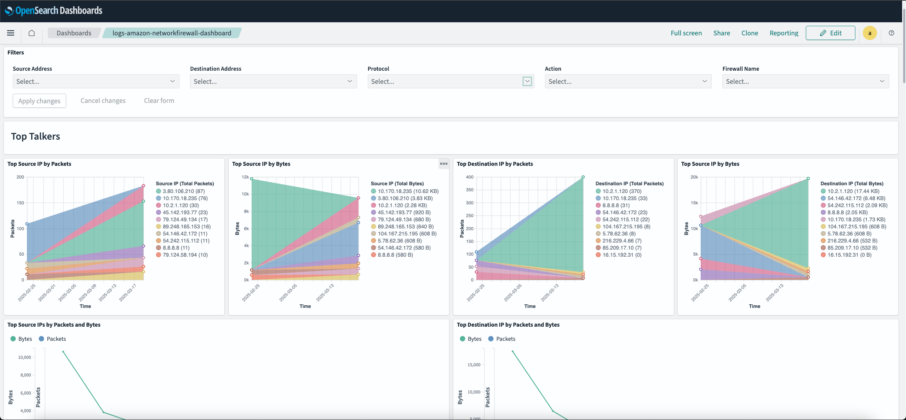
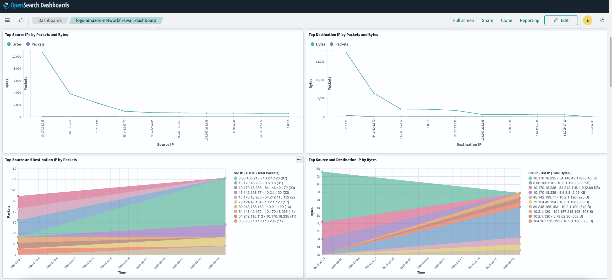
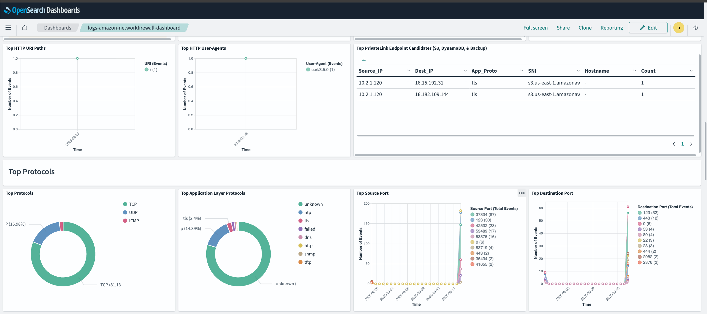
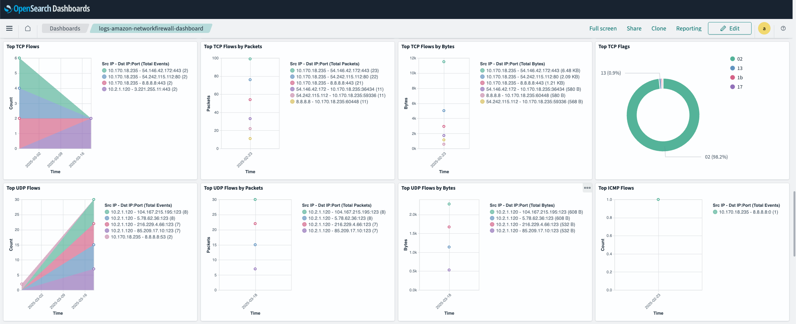

# AWS Network Firewall Integration

## What is AWS Network Firewall?

AWS Network Firewall is a managed network security service that helps protect your AWS Virtual Private Cloud (VPC) resources from network threats.

AWS Network Firewall can be used for various purposes, such as:

1) Network Traffic Filtering:
- Filters incoming and outgoing VPC traffic
- Protects traffic going to and from internet gateways, NAT gateways, VPN connections, and AWS Direct Connect
- Supports both IPv4 and IPv6 traffic

2) Security Controls:
- Creates and enforces customized network security rules
- Provides stateful inspection of network traffic
- Performs deep packet inspection to examine packet contents
- Filters traffic based on IP addresses, ports, and protocols

3) Threat Prevention:
- Blocks known malicious domains
- Prevents unauthorized access to your VPC resources
- Protects against common network threats
- Integrates with AWS WAF for additional web application protection

4) Traffic Management Components:
- Rule Groups: Collections of rules for traffic inspection
- Firewall Policies: Define sets of rules and behavior settings
- Firewalls: Connect rules to your VPC and manage traffic filtering

5) Monitoring and Logging:
- Monitors network traffic in real-time
- Provides logging capabilities for traffic analysis
- Enables tracking of rule matches and traffic patterns

For more details, please see the following:

-> [What is AWS Network Firewall?](https://docs.aws.amazon.com/network-firewall/latest/developerguide/what-is-aws-network-firewall.html)

-> [Firewall behavior in AWS Network Firewall](https://docs.aws.amazon.com/network-firewall/latest/developerguide/firewall-behavior.html)

-> [AWS Network Firewall Features](https://aws.amazon.com/network-firewall/features/)

## What is AWS Network Firewall Integration?

An integration is a bundle of pre-canned assets which are brought together in a meaningful manner. AWS Network Firewall Integration includes dashboards, visualizations, queries, and an index mapping.

AWS Network Firewall Integration can be used by configuring your Network Firewall to send your firewall logs to Amazon S3. To do this, you must configure an Amazon S3 bucket as the log destination. In the bucket configuration for your firewall, you can optionally include a prefix that appears immediately after the bucket name. When enabling logging to Amazon S3 in Network Firewall, provide the bucket name and, if you use one, the prefix.

You can log the following types of logs from your Network Firewall's stateful engine.

- Flow logs are standard records of network traffic flow. Each flow log captures network flow for a specific set of standard stateless rules.
- Alert logs report traffic matching stateful rules that have an action that sends an alert. A stateful rule sends alerts for the DROP, ALERT, and REJECT actions.
- TLS logs report events related to TLS inspection. These logs require that your firewall be configured for TLS inspection.

For additional information about the contents of an AWS Network Firewall log and how to send this data to an S3 bucket, please see the following:

-> [Contents of a AWS Network Firewall log](https://docs.aws.amazon.com/network-firewall/latest/developerguide/firewall-logging-contents.html)

-> [Sending AWS Network Firewall logs to Amazon Simple Storage Service](https://docs.aws.amazon.com/network-firewall/latest/developerguide/logging-s3.html)

### Dashboards

The Dashboard uses the index alias `logs-amazon-networkfirewall` for shortening the index name - be advised.

