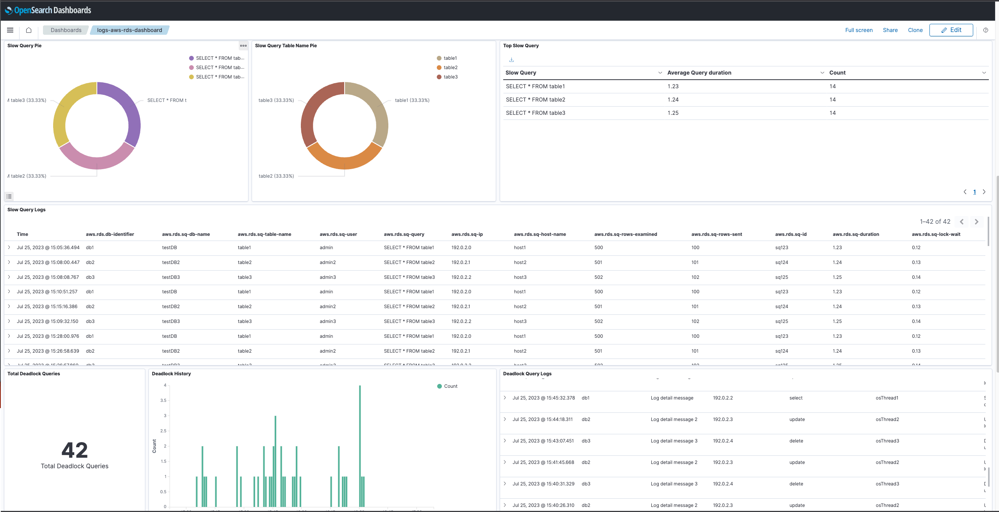

# AWS RDS Integrations

## What is AWS RDS?

AWS RDS (Relational Database Service) is a managed service that makes it easy to set up, operate, and scale a relational database in the cloud.

RDS helps you perform tasks such as:

- Managing database instances
- Scaling compute resources and storage capacity
- Automating time-consuming administration tasks including hardware provisioning, database setup, patching, and backups

RDS keeps your database up-to-date with the latest patches, and it also provides automatic backups and disaster recovery capabilities. You can make database instances available in multiple regions to enhance availability and reliability for your data.

See additional details [here](https://docs.aws.amazon.com/AmazonRDS/latest/UserGuide/USER_LogAccess.html).

## What is AWS RDS Integration?

An integration is a collection of predefined assets which are combined in a meaningful manner.

AWS RDS integration includes dashboards, visualizations, queries, and index mapping to help you manage and monitor your database services more effectively.

### Dashboards

The Dashboard uses the index alias `logs-aws-rds` for shortening the index name - be advised.

This integration provides you with a comprehensive view of your RDS instances, enabling you to monitor performance and resources effectively, troubleshoot problems quickly, and make data-driven decisions.
