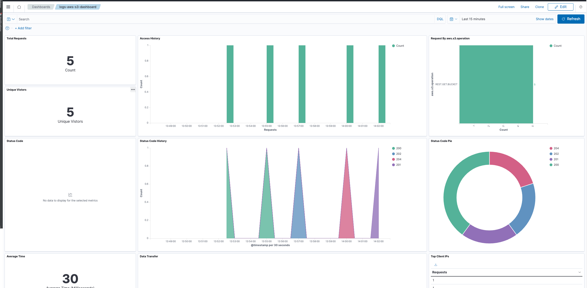

# AWS S3 Integration

## What is AWS S3?

Amazon S3 (Simple Storage Service) is an object storage service that offers industry-leading scalability, data availability, security, and performance. It is designed to make web-scale computing easier for developers.

See additional details [here](https://aws.amazon.com/s3/).

## What is AWS S3 Integration?

An integration is a bundle of pre-canned assets which are brought together in a meaningful manner.

AWS S3 integration includes dashboards, visualizations, queries, and an index mapping.

### Dashboards

The Dashboard uses the index alias `logs-aws-s3` for shortening the index name - be advised.

