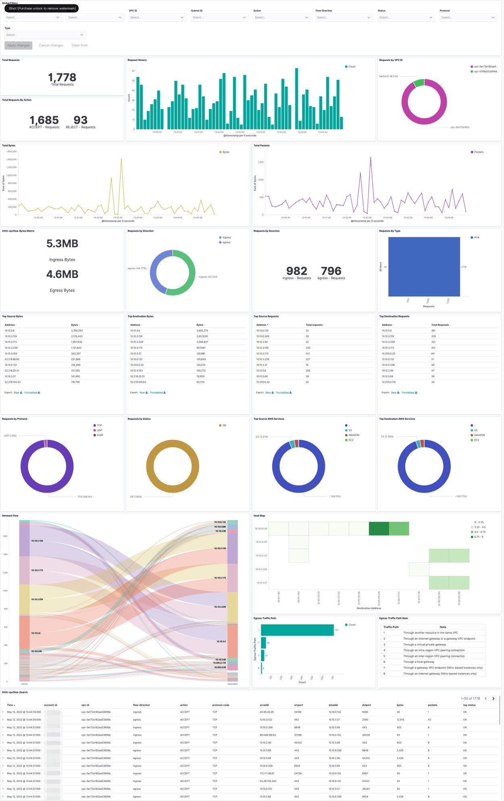

# AWS VPC Flow Logs Integration

## What is AWS VPC Flow Logs ?

VPC Flow Logs is a feature that enables you to capture information about the IP traffic going to and from network interfaces in your VPC.

Flow logs can help you with a number of tasks, such as:

- Diagnosing overly restrictive security group rules

- Monitoring the traffic that is reaching your instance

- Determining the direction of the traffic to and from the network interfaces

Flow log data is collected outside of the path of your network traffic, and therefore does not affect network throughput or latency. You can create or delete flow logs without any risk of impact to network performance.

- See additional AWS Logs Info details [Here](https://docs.aws.amazon.com/vpc/latest/userguide/flow-logs.html).
- S3 Glue VPC integration [Readme](Flint-Integration.md)

## What is AWS VPC FLow Logs Integration ?

An integration is a bundle of pre-canned assets which are bundled togather in a meaningful manner.

AWS VPC flow logs integration includes dashboards, visualisations, queries and an index mapping.

### Dashboards

The Dashboard uses the index alias `logs-vpc` for shortening the index name - be advised.

