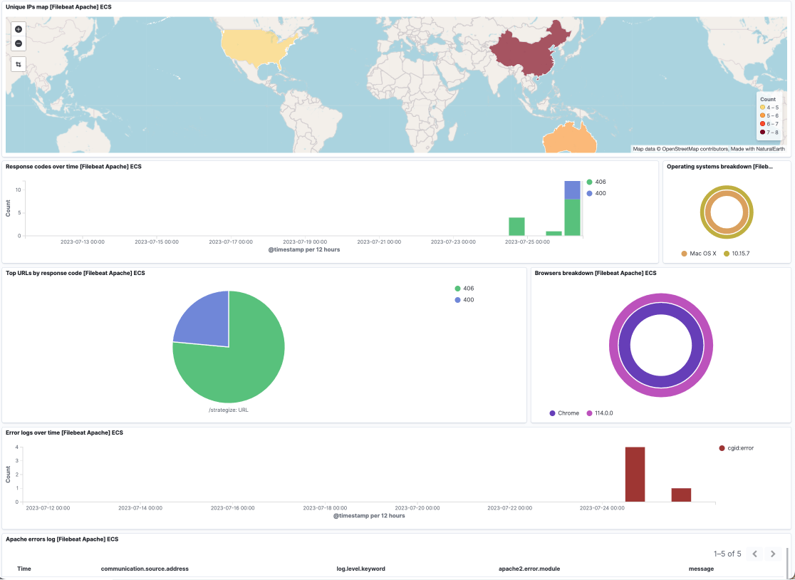

# Apache Integration

## What is Apache ?

Apache is an open source web server software for modern operating systems including UNIX and Windows.

See additional details [here](https://httpd.apache.org/).

## What is Apache Integration ?

An integration is a bundle of pre-canned assets which are bundled togather in a meaningful manner.

Apache integration includes dashboards, visualisations, queries and an index mapping.

### Dashboards

