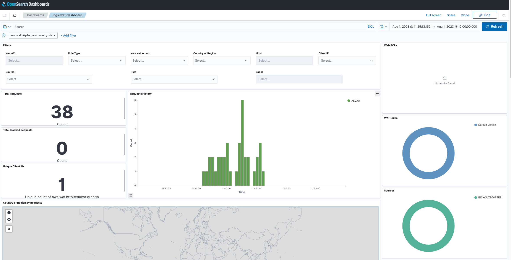

# AWS WAF Log Integration

## What is AWS WAF?

AWS WAF (Web Application Firewall) is a web application firewall service that helps protect your web applications from common web exploits that could affect application availability, compromise security, or consume excessive resources. AWS WAF provides firewall rules to filter and monitor HTTP/HTTPS requests based on specific conditions.

AWS WAF can be used for various purposes, such as:

- Mitigating web application layer DDoS attacks
- Blocking common web attack patterns like SQL injection and cross-site scripting (XSS)
- Filtering traffic based on IP addresses or geographic locations
- Controlling access to specific parts of your application

AWS WAF allows you to define rules to match specific conditions and then take actions, such as allowing, blocking, or rate-limiting requests, based on those rules.

See additional details [here](https://aws.amazon.com/waf/).

## What is AWS WAF Log Integration?

An integration is a set of pre-configured assets bundled together to facilitate monitoring and analysis.

AWS WAF log integration includes dashboards, visualizations, queries, and an index mapping.

### Dashboards

The Dashboard uses the index alias `logs-waf` for shortening the index name - be advised.

