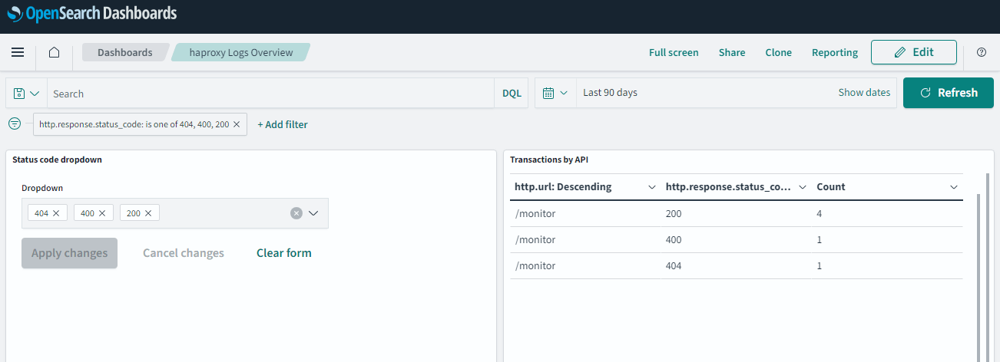
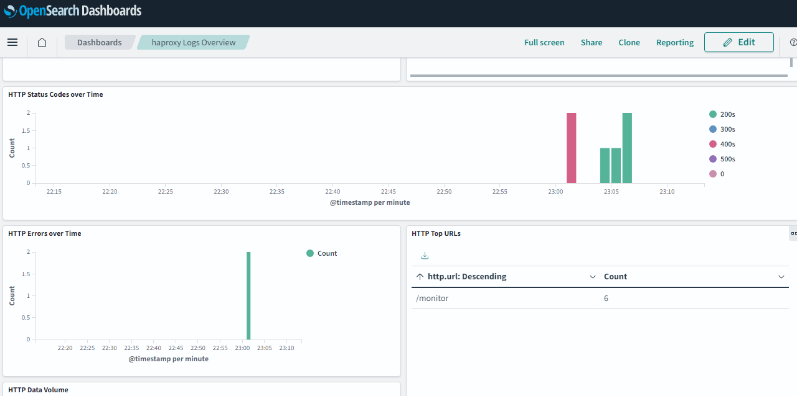

# HAProxy Integration

## What is HAProxy?

HAProxy is open-source software that provides a high availability load balancer and proxy server for TCP and HTTP-based applications.

See additional details [here](http://www.haproxy.org/).

## What is HAProxy Integration?

An integration is a bundle of pre-canned assets that are packaged together in a meaningful manner.
HAProxy integration includes dashboards, visualisations, queries and an index mapping.

### Dashboards

