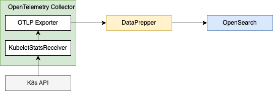

# Getting Started
Integrating Kubernetes (K8s) logs into an OpenSearch system enables efficient storage, transformation, and analysis of cluster logs. This document will guide you through setting up Data-Prepper in a Kubernetes environment to collect, transform, and ship logs to OpenSearch.
To collect all of this data we’ll use the OpenTelemetry Collector. The collector has many different tools at its disposal which allow it to efficiently collect all this data and enhance it in meaningful ways.

## Overview
Kubernetes exposes a lot of important telemetry in many different ways. It has logs, events, metrics for many different objects, and the data generated by its workloads.
To collect all the data, we’ll need two installations of the collector, one as a [Daemonset](https://opentelemetry.io/docs/collector/deployment/agent/) and one as a [Deployment](https://opentelemetry.io/docs/collector/deployment/gateway/).

The Daemonset installation of the collector will be used to collect telemetry emitted by services, logs, and metrics for nodes, pods, and containers. The deployment installation of the collector will be used to collect metrics for the cluster and events.

To install the collector, we’ll use the [OpenTelemetry Collector Helm chart](https://opentelemetry.io/docs/kubernetes/helm/collector/), which comes with a few configuration options that will make configure the collector easier.
If you’re unfamiliar with Helm, check out the [Helm project site](https://helm.sh/). For using a Kubernetes operator, see [OpenTelemetry Operator](https://opentelemetry.io/docs/kubernetes/operator/), this guide will focus on the Helm chart.


## Setup
Starting with a common reproducible metrics generation scenario. 
In this case, we can connect to a running K8s cluster for which we want to analyze container metrics.
These metrics can be generated by the OpenTelemetry Collector using the [Kubelet Stats Receiver](https://github.com/open-telemetry/opentelemetry-collector-contrib/blob/main/receiver/kubeletstatsreceiver/README.md).

### Create K8s Cluster
This guide will assume the use of a [Kind cluster](https://kind.sigs.k8s.io/), but you’re free to use any Kubernetes cluster.

Assuming you already have [Kind installed](https://kind.sigs.k8s.io/#installation-and-usage), create a new kind cluster:

```
kind create cluster
```

Assuming you already have [Helm installed](https://helm.sh/docs/intro/install/), add the OpenTelemetry Collector Helm chart so it can be installed later.

```
helm repo add open-telemetry https://open-telemetry.github.io/opentelemetry-helm-charts
```

### Daemonset Collector
The first step to collecting Kubernetes telemetry is to deploy a daemonset instance of the OpenTelemetry Collector to gather telemetry related to nodes and workloads running on those node. A daemonset is used to guarantee that this instance of the collector is installed on all nodes. Each instance of the collector in the daemonset will collect data only from the node on which it is running.

This instance of the collector will use the following components:

- **OTLP Receiver**: to collect application traces, metrics and logs.
- **Kubernetes Attributes Processor**: to add Kubernetes metadata to incoming application telemetry.
- **Kubeletstats Receiver**: to pull node, pod, and container metrics from the API server on a kubelet.

### OTEL Receiver
It is a common practice for applications running on a node to emit their traces, metrics, and logs to a collector running on the same node.
This keeps network interactions simple and allows easy correlation of Kubernetes metadata using the k8sattributes processor.

```yaml

```

### Kubernetes Attributes Processor
The Kubernetes [Attributes Processor](https://opentelemetry.io/docs/kubernetes/collector/components/#kubernetes-attributes-processor) is a recommended component in any collector receive telemetry from Kubernetes pods.
This processor automatically discovers Kubernetes pods, extracts their metadata such as pod name or node name, and adds the extracted metadata to spans, metrics, and logs as resource attributes.
It adds Kubernetes context to your telemetry and it lets you correlate your application’s traces, metrics, and logs signals with your Kubernetes telemetry, such as pod metrics and traces.

```yaml

```

### Kubeletstats Receiver
Each Kubernetes node runs a kubelet that includes an API server. The Kubernetes Receiver connects to that kubelet via the API server to collect metrics about the node and the workloads running on the node.

There are different methods for authentication, but typically a service account is used. The service account will also need proper permissions to pull data from the Kubelet.
If you’re using the [OpenTelemetry Collector Helm chart](https://opentelemetry.io/docs/kubernetes/helm/collector/) you can use the [kubeletMetrics preset](https://opentelemetry.io/docs/kubernetes/helm/collector/#kubelet-metrics-preset) to get started.

By default, metrics will be collected for pods and nodes, but you can configure the receiver to collect container and volume metrics as well. The receiver also allows configuring how often the metrics are collected:

#### K8s Cluster Role Setup

Since the processor uses the Kubernetes API, it needs the correct permission to work correctly. For most use cases, you should give the service account running the Collector the following permissions via a ClusterRole.
```yaml
---
apiVersion: v1
kind: ServiceAccount
metadata:
  name: otel-collector
---
apiVersion: rbac.authorization.k8s.io/v1
kind: ClusterRole
metadata:
  name: otel-collector
rules:
  - apiGroups: ['']
    resources: ['nodes/stats']
    verbs: ['get', 'watch', 'list']
---
apiVersion: rbac.authorization.k8s.io/v1
kind: ClusterRoleBinding
metadata:
  name: otel-collector
roleRef:
  apiGroup: rbac.authorization.k8s.io
  kind: ClusterRole
  name: otel-collector
subjects:
  - kind: ServiceAccount
    name: otel-collector
    namespace: default

```

### Exporter Setup
```yaml
exporters:
  otlp:
    endpoint: "<your-DataPrepper-url>"
    tls:
      cert_file: "./cert.pem"
      key_file: "./key.pem"
metrics-pipeline:
  source:
  otel_metrics_source:
    ssl: true
    sslKeyCertChainFile: "./cert.pem"
    sslKeyFile: "./key.pem"
  processor:
    - otel_metrics:
  sink:
    - opensearch:
        hosts: [ "<your-OpenSearch-url>" ]
        username: "otelWriter"
        password: "<your-password>"
        index: "ss4o_metrics-k8s-%{yyyy.MM.dd}"

```
This connection approach uses basic authentication for OpenSearch. It requires the otelWriter backend role with sufficient permissions for Data Prepper. 




### Simple Schema For Observability
OpenTelemetry protocol uses a well-documented [Metrics Data Model](https://opentelemetry.io/docs/specs/otel/metrics/data-model/),[ Simple Schema for Observability](https://opensearch.org/docs/latest/observing-your-data/ss4o/) materialize this protocol into a `_index_template` that follows the Otel semantic conventions.
Using this index template will allow a standard way to ingest and visualize data which follows these standards and simplify the way for introducing well structured dashboards.

Note that the attributes contain a lot of `@ characters`. In the OpenTelemetry semantic conventions that specify attributes and metric names, there are dots “.” instead. 
Since OpenSearch treats those dots as nested fields, Data Prepper applies this `.` to `@` mapping to avoid conflicts.

### K8s Integration
An integration is a collection of pre-configured assets that are bundled together to streamline monitoring and analysis.

Kubernetes integration includes dashboards, visualizations, queries, and an index mapping.

### K8 Dashboards


With the Kubernetes integration, you can gain valuable insights into the health and performance of your containerized applications.

The pre-configured dashboards and visualizations help you monitor key metrics, track resource utilization, and identify potential issues within your Kubernetes clusters.

This integration empowers you to efficiently manage your containerized workloads, scale applications as needed, and ensure the reliability and availability of your Kubernetes environment.
