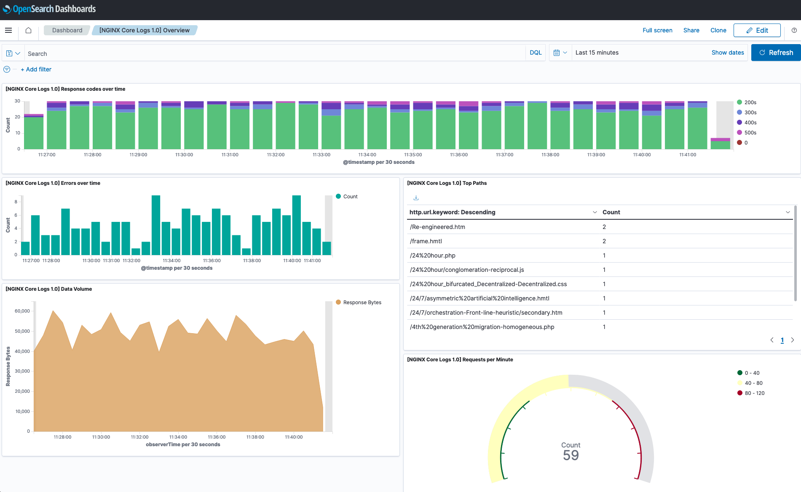
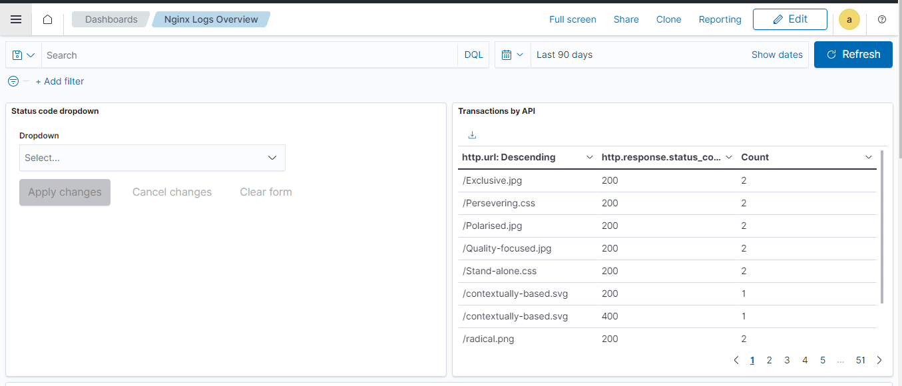

# Nginx Integration

## What is Nginx ?

NGINX is open source software for web serving, reverse proxying, caching, load balancing, media streaming, and more.

See additional details [here](https://www.nginx.com/).

## What is Nginx Integration ?

An integration is a bundle of pre-canned assets which are bundled togather in a meaningful manner.

Nginx integration includes dashboards, visualisations, queries and an index mapping.

### Dashboards

