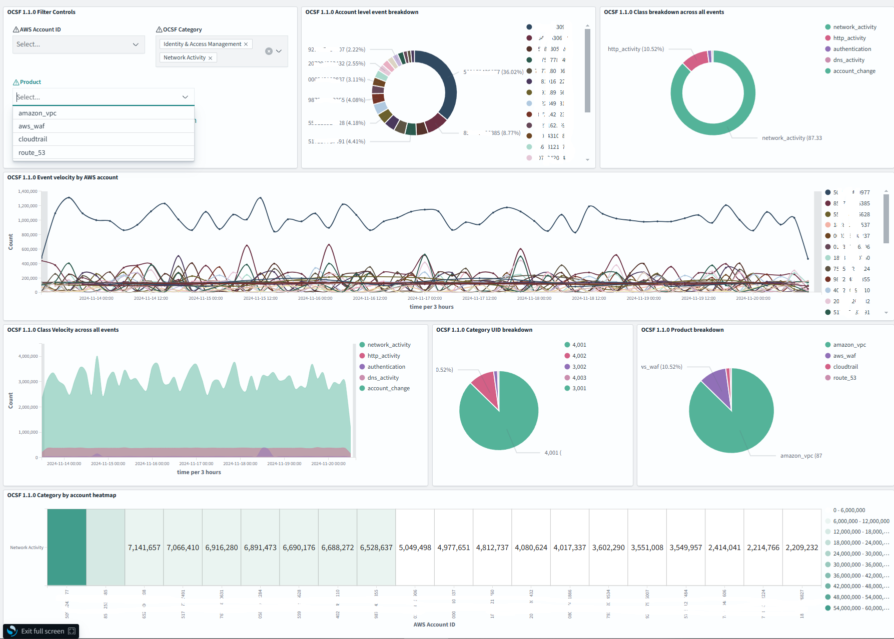
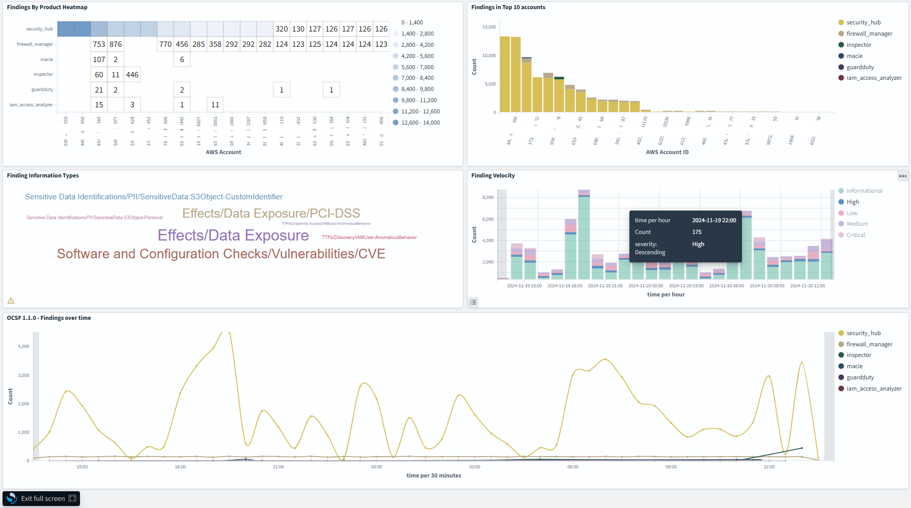
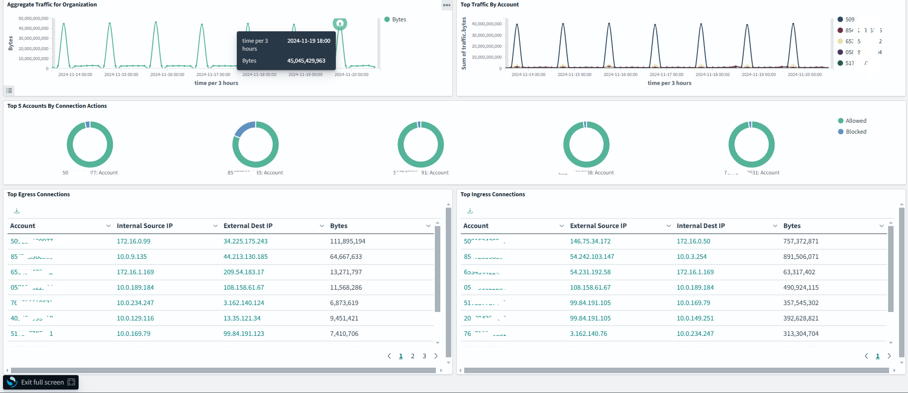
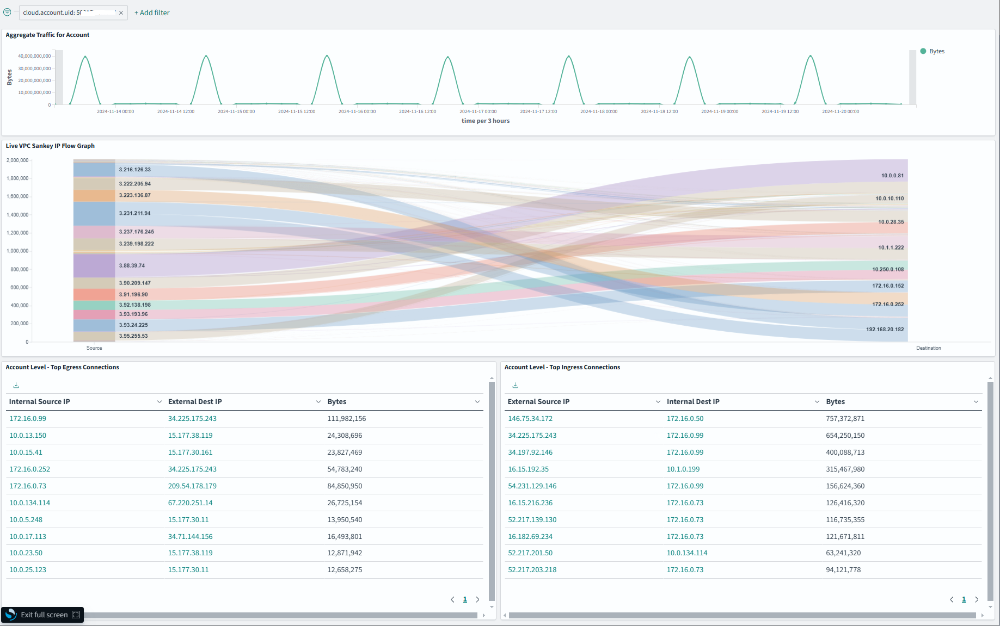
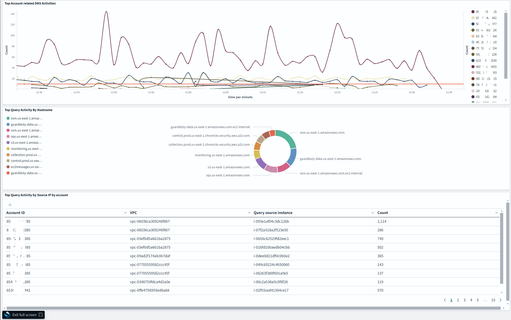

# README
# OCSF 1.1.0 integration with OpenSearch

## Overview
This section provides resources that will help you ingest [Open Cybersecurity Schema Framework](https://schema.ocsf.io/1.1.0/) (OCSF) logs into OpenSearch and use the logs for [Security Analytics](https://opensearch.org/docs/latest/security-analytics/)

 It consists of index and component templates, OpenSearch Ingestion template, [Index State Management](https://opensearch.org/docs/latest/im-plugin/ism/policies/) policy initialization scripts, and saved objects (visualizations and index templates).

## Overview of components
### Index and component templates
Index templates (`schemas/index_templates`) automatically apply predefined settings and mappings to indices. 

Component templates (`schemas/component_templates`) are reusable building blocks that contain mapping definitions. Component templates are used as part of index templates. 

The current set of index and component templates are mapped to the OSCF 1.1.0 standard. The repository contains index templates for the following OCSF 1.1.0 categories and classes:

  - System Activity
    - OCSF 1001 - File System Activity
    - OCSF 1002 - Kernel Extension Activity
    - OCSF 1003 - Kernel Activity
    - OCSF 1004 - Memory Activity
    - OCSF 1005 - Module Activity
    - OCSF 1006 - Scheduled Job Activity
    - OCSF 1007 - Process Activity
  - Findings
    - OCSF 2002 - Vulnerability Finding
    - OCSF 2003 - Compliance Finding
    - OCSF 2004 - Detection Finding
    - OCSF 2005 - Incident Finding
  - Identity and Access Management
    - OCSF 3001 - Account Change
    - OCSF 3002 - Authentication
    - OCSF 3003 - Authorize Session
    - OCSF 3004 - Entity Management
    - OCSF 3005 - User Access Management
    - OCSF 3006 - Group Management
  - Network Activity
    - OCSF 4001 - Network Activity
    - OCSF 4002 - HTTP Activity
    - OCSF 4003 - DNS Activity
    - OCSF 4004 - DHCP Activity
    - OCSF 4005 - RDP Activity
    - OCSF 4006 - SMB Activity
    - OCSF 4007 - SSH Activity
    - OCSF 4008 - FTP Activity
    - OCSF 4009 - Email Activity
    - OCSF 4010 - Network File Activity
    - OCSF 4011 - Email File Activity
    - OCSF 4012 - Email URL Activity
    - OCSF 4013 - NTP Activity
  - Discovery 
    - OCSF 5001 - Device Inventory Info
    - OCSF 5002 - Device Config State 
    - OCSF 5003 - User Inventory Info
    - OCSF 5004 - Operating System Patch State
    - OCSF 5019 - Device Config State Change 
  - Application Activity
    - OCSF 6001 - Web Resources Activity
    - OCSF 6002 - Application Lifecycle
    - OCSF 6003 - API Activity
    - OCSF 6004 - Web Resources Access Activity
    - OCSF 6005 - Datastore Activity
    - OCSF 6006 - File Hosting Activity
    - OCSF 6007 - Scan Activity

### OpenSearch Ingestion template
The OpenSearch Ingestion template (`assets/OSI-pipeline.yaml`) provides a template you can use with an OpenSearch Ingestion pipeline to ingest OCSF data. 

### Index State Management (ISM) policy
The ISM policy (`assets/ISM.json`) rollsover the indexes daily or when they have reached 40GB. The ISM policy also deletes indexes that are more than 15 days old.

### Initialization scripts
The initialization scripts helps set up the component templates, index templates, ISM policy, and aliases in the OpenSearch cluster. 

There are two scripts - one that uses basic auth (`assets/os_init_basic_auth.py`) - and one that uses IAM auth (`assets/os_init_IAM_auth.py`). 

### OpenSearch objects
The OpenSearch objects (`assets/OCSF_objects.ndjson`) contains visualizations, dashboards, and index patterns to help you get started with exploring OCSF data. Visualizations include: 

* OCSF High level overview (All OCSF categories) page

* OCSF Findings (2000 series) overview page

* Network Activity (4001) Org level overview

* Network Activity (4001) Account Level Drill Down

* DNS Activity (4003) Org level overview

## Installation instructions
1. Download the index and component template zip files. Upload it to an S3 bucket or save it to your local machine.
2. Download the right initialization script based on how you would like to authenticate to OpenSearch (basic auth or AWS IAM). 
3. Modify the variables in the initialization script. You will need to add your OpenSearch cluster endpoint, authentication information, and the location of the index and component templates.
4. Run the initialization script. 
5. Log in to the OpenSearch cluster and upload the OpenSearch objects in the **Saved Objects** screen under **Dashboards Management**.  