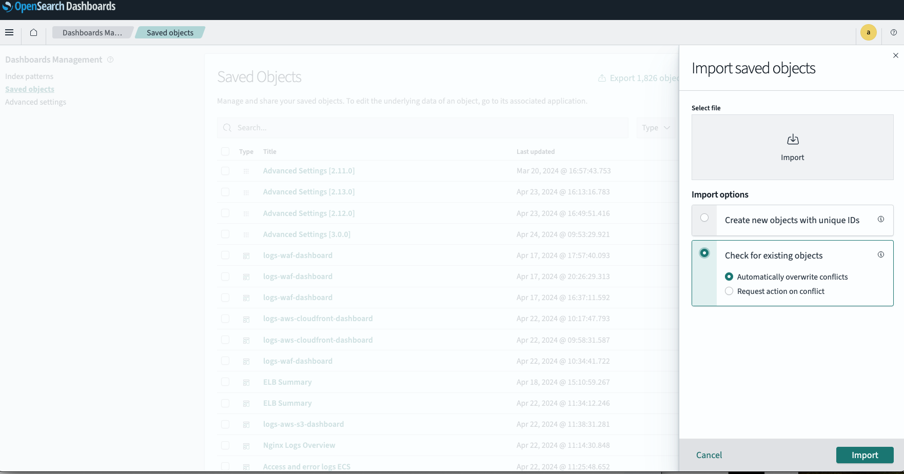

## **OpenSearch Dashboards Linking And Navigation**

In many cases its important for users to create the flow behaviour of an application which includes a fluent navigation from one
perspective to the other by simply pressing a button or selecting a visual component.

OpenSearch dashboards doesn’t allow this naturally and requires some tweaks for achieving this - this short gist will show you how its done:

**Prerequisites** :
- Understanding Dashboards
- Having at least 2 dashboards to navigate between
- Understanding Visualizations (the inner panels within a dashboard)
- Dashboard config updates:
  - Enable vega external URL navigation: `vis_type_vega.enableExternalUrls: true`
  - Enable Dashboard's `Store URLs in session storage` under the advanced setting
  

**Vega:**

Let's begin by introducing vega:

Vega is a powerful language for creating custom visualizations, and its integration into OpenSearch Dashboards enables users to craft complex and highly customized charts and graphs that go beyond the standard visualizations.

By using Vega you can define both the aesthetics and the behavior of their charts with a granular level of control.
This flexibility is particularly useful for visualizing intricate datasets or when specific visualization formats are required (that are not available by default in standard visualizations).

- [vega examples](https://vega.github.io/vega-lite/examples/)
- [vega online editor](https://vega.github.io/editor/)

---
**Services Network Graph**

The next visualization I've prepared is a network graph like chart showing different services, I've linked it [here](https://vega.github.io/editor/#/url/vega/N4IgJAzgxgFgpgWwIYgFwhgF0wBwqgegIDc4BzJAOjIEtMYBXAI0poHsDp5kTykSArJQBWENgDsQAGhAB3GgBN6aAIwAWAAwaZ8GmSxoAHFpk4kChTXFk0oADZwAZpjTaQAJz0HUbzGxyuMkxs2GwIrgC+MkgMfhA0AF5waCBmCtIgTEhQANZk7mwM4unoAMSOao4A7I6OGfFk4kh2EGgA2qBNCMnofmx2mDQBMsTNDD3AUSAS7aBwpOKYregQAJ4IwXaoCIUQcGyk7hkMOApImD0gZ5gM4VFzC0spaxv927v7scen55eTIBEALr3EBdS4AD3cSGsyRkJ2ulza2gABPIlDBAQCpJ0kN0UqsoTDvgiUm1dPpMFJkRpMSCwSlwXBwS44T8LqSUWj6LTsaDcZdVkyWSB4b9SeSsFSaVicXj0Ao2LJJCMxj1xAw7HYZDNUB0QPM4ItliAdgw9icpH4GLBDelWST0OrNTL9Y9jaa9gqlVSrbAIJgkO5haL2ehwasABQAShdBqNz3Wm3eZrgXvEVJeSd9MH9geDbMuTrsAOBvPpYagDCOKrs4zQRe1kl1D0NT3QHtTivTyOzuaDPsKNuKxLFYYVd1LsoFlerIFGtbVGq10yberjbZNHzTA+tOYD-Z7g-gw-to5Aq3HJbp-JSCjgAxQNbruu0NMbs1dreWerEVagl3kYpFQyTBVhwS4Ox2UgMigCQIFuHpMHccYgjgTBZDgQ0P1A8CUg7NMXV-dx-xSQCvRAsCII+E4r15HDLmzKDYRAWDxHguUkJQkBHBoAY4COdB10obM4AgSgHGsehkQAXlk5EVBLU9QyuLtkQAfmRNo0yRQEAFpwWjKlIyjXTtJUQFAWRVBNNfWlJz5OUQGhWA2FnednyRKQ3xXD912NWR4HvEdlLaKxDkwCMAHJwWgZo4EiqkDKjKMqTC-iIsi1ZYocBLkWMqMeRbeNUFAeiUl7fdhR4viBM-RZhKPUTxMNMh6Fk6SACYsRFAtSQjcFxx05EAGpkQGsI2nMqNkQIZEOqpCMLwmmkRrywappmua7OvRyEjYMIMncnoVHfZs6o3ALMLsABCDJHFckjUE4uAlMuHBFQjFRKC0E7kSEu8HwATWRAAqZF3tkT6ADYqX++8AwAWTYO9ktjN1bBABommLeUaH9Lqpnu4jEOQl6eodK48cwFRNssfG0a-D8iMeucaDgWQKNw+UmDsKA7BoXJFPJs8FKBHbLjp6nDtVQIfLOvyMbK3ojz7KreIuWqhJEsSJNamB2oJ16UhwKxYAAESp5y4AjdcYxBBWSsxvRsdvKnDeF5TJYJ+zy0p+mnx6NwdTXdHHaVkBGIOZjWPYkmuOqjWUi1xqdZatrZPdkM3tNmALdzcR-xtx47Z9m8xwOo2wyFDJg6KttQCx5pb3hlApiz0lwRnIbRogMxxH6mdprBgGAyG2auRgRKu-M1be+hAeqyH5ER6QMfUUUbkGeKhvnab9A9oOtvevQNpnJgVzu+RfrBpW3TkTPi+aSXg+ECpB-3Ev6+Jpnu-3505-9oIEKudb8DdCjExSMQNmHMZDhwUDzPmAschC3bmGQkZBkhizLGXc8l5K7nmrqdEOjNHaNxxlcFu3VUEgDaKsLuK0e590WoPUGy8W6TUsrNCUlI8rT0sow+edDF6sJXhwza3DgEOx3o0PeIAX5UOPjQv+M9RqLRvpZX+Bdz4fw2mDF+b8tEXxUVfJaCAxGaJcjowEACwiSNDj+cBLMoHs05hLBB-NBZAnwQSaEGDaJTmeIkZi1C+a4hwBGDqGhNpz37uNBAKV5JUhUFoDQdtsGOSgOCYKAEN4wE2l1IhddjRtEzG8fCXYqRkUVMmc0OBLIAD515AVkDUxAUdskpGRJk2SE8CAdTUpk4aGhvoaBUKgXp3txYpCgKsDp6BuH5JdL7cQyM4AACVzA0DNAAaTgLMmQd5oCeBwIMHUIAACO0lTbuDgEgPYyJ4hJDftJO8UAbl3LgA8oJ0sFxGEKSA0iVgvSoByHsnANyICtHwUJUFqxZKRSQJFAAZEilZd4NmWB2Xs+pKg1JovWZsrFqxdJjJhXs+F5zIp4tWRirZEBdmrGGmM-FtKiX+IcoWGlhKoVzhlqgQwQQgUYysDgL46B0HMQQFYVQMhkBZNQAINw-o4ABFQCoKYtcAWkN3uQll3KGUKIpnqzF9K9nsuWasgAwjAQMfiA5oF0gAZjcEwIVjsRVio8L4yV0rUAkpMCaJA8rkkyGVaq9VUz0D83EDkPOAYC7MSOmgZ1grhzuvEKKlw4rvUZClU2AQsqg3JoDWG1QEQQSHLeUMU5TYQAAGUAwXGRKMTwSAeafKJvfKAgxSDInxciHi4IHmNrNJQDIvtB0-OfI4Zoex-kO0xomMpHxCiYDaNdISTBYh+DYoCSpQLqkdhovgmdLRMG8gXaUrYHYo6zmoYO5EAAfR9PZSZ3QenHOA9tQ40Kva07cTTgVHrqciRpVSWmQSjrdfB4ZozvogU9UmWDQCVuOTWlIABxKEOA8n9p2P6ZENz-yLDsKsZEVgNbZAuAode9Ax0yAtXeKdi5NTzp-X+m9hw5ncRoEO9qr7xjqWXucW4rBihMisn21Z5qcH4oABK3uY8KkoDYWISHEHAbt7A2LtFLHLYhxVF2vGvSurj+DgCRUUJFVA1xRNAqZFSSKrENNabgtZ3u-MIq2YQJQZmolhoJUisNbzwlbVoQgFIQLUYIhbw3BxldXxzOWYUNZhsyInPqc0zWiA1m2jAnZah6t2mUgADE7BIDIIeQjolKrIhKx+r5CANTnG08iE4EhhMBi6TamEYlx04IhZVJTqBT1zv00UjGZCUiTqPhTB9KKB28eapJGAV491XHOCgM6jG4CmU27pKEMDeULlASAWF02CiLFtBkBUUAAD6sEihZpUIYEE530A2lyKuvY7goEkQOWwe7j3FiqA6m9s16BwXI2tJgKAm27BsDID9v7zFbsPcKCD-l4PZkfbzMjgWqPAfo6e2gKo2Ppu3JuDcxw5Wkf8RRzdonwOs1Q3J5DpA6wvz04J4zoHGOWds5YlWG5Bcsrc-+ypPnJOFWC6I2EboxQWtwXF4TqXmOBCC4gDAIYJtrD44l2j5naANe8ne-qZAvF9eq+J+rwX2RmdWDp79nnAO1dZo1+tomyAs2lUoikUQMwphIWhBAL32E-foC981jITJwUpEilgXAhACAI7h3Yc+-oFVQ1GQQJAOAcAEDOFr4IgYFAQFKCQaBnBHcOF0lb3SsF3A3PK9Rvbxe2Cl5JXdjQ3e7sAEkzZqTu0gaSEZCsnO06gAApB1KoM+qhSATvxfA10IwRnn5ARtcB5+oAjP6VycBUB55wA234KVugBl380GgdzUDXXTHTNtDgFB38cFIWFqArcADl+RSA0xQC4V-KQMwKEBAfACMc5cYdwVYVASKVaELb-fkVaSKFKeiVAHDKEPYFKSA-iGAiMb3WAO7DAj5XfRA7oWA+AkTHzMEZA5KZKRfJcOtN5TCcQJGO8IA-wbLXfbXO8AABWhHvAABU6AHAV838UwEZbUrAV9MBsCoC8DytrAGAKtD8ch5CpAcDoDp9Z959UCaBug1kasD8gDBhMAHBP8a9dt69G9m9fgFA28YAS93AFApBnFZA2DD83CoxIoMg7kUho1kEQRw4o9ysY9wQ495QqDKBDd+dfDjRg9-xLV+dWggiI9uJXImtQiZBY9aoQtztohjR6RUiuZ0j3BMjHx9Rwjcioj8inJjR8hCgAhkMOV-CrAcg9sAwDskAjs7lVgC40BnoA5TszdHBLsLgTxJcbdnsBUI4wsfdMhrRQU2w9Qzc4cgwrdecpjk1BcocFAYc4cAwEcncGdXctjUBHVBcZwRcZkNjTijdUAwdTcIcnIy8VdNj7j1UniccWJ4AvtYhbjJiPjZdNN5dbQlc2I3i7jYi1UxZLjfichvtITAToSVB5pZj3AMF5iYins7t+ICh3A7sThwICTggigSglVbg7sQh4ACTsTMcXVFjwsPxVi8ckS6Ss1HjQAzctcddHcAT2S0BOSztnj7d+c+S2SmcUTLjhdDQbiJS3cy0vik4Lcz1ncDdJTpdPiuTnjRiYgLA0IsttN+SNTMctThTvizBOcjR5SzizSzddj9j4dEdjSFSYTgQvFSjvdFY0iA9JAg9CRQ8Mjw8Siadzhxi7o2Y7Ay92h0TMTKAt1cgmT1s-DdRYy0IAAhRklweyYIjI6PbIqo28KIgUgoyBGWYoy4EIionIosm4HzWolMzGRxc9X3EMvMrIyoiIjbOs0LDEjMrMygBs+IuYl0cOBHNgNQ4YbiAocIR0VZDopALoo7M3ekGQHie8aM1MvzECEc5M78Jsv8OAL-aTWBOY48pjHMtIpfWcGsyInsvzc8z5a6OSIsZEBbELfcTEx85EZ86SPtJcGTRyAIhc+oZs1omNBcpcpZHBPzBvTLVzHTUNMCqNNoyCw7ECAMsPM6cOCrfIPgdkGQBok4JgHHNoA8iBdbfwfco6VoT3SMzcsiz8tCEAPcmM5zQ0uCFiis6bdsioxspip4AsrsnAWsXIMfKI9ihCiLdLASlAwChiOYuC8QFzbLUCw88C9o64Rc9C2BTCoM7CtI3Cm5AA5iIinAEimMgSli7UPAGMmi6ynjDc-c7c1i1MyS1Sy8tsso-Muo54ZsnlW81IUSnIcSns9yo0xzPzOS5onbECpC9Sucu8NC7ojCkPLCvUMc-aScu6Gcvyw8pSlSo0jIbksCtc+i-c+kdbey1MgS2i0smquYuqihGdDULNMiriuiNI8c7Ktc3K3oRS8KzimQM3KysqpymMyqoYmMvzJqlMsimahyu8FqgYGMjq1sysj9DIOgficE5YZ1NwQbPMSbHVFIQ6oMbqKbSPTatcj9U7ImFmYjROGQeVaRF2D7LJKYHHV62RGZAEEEe6y4WCTURQZiKEE1Y6mRchCAc5IMCMNQVhY1OlBGrlE1NJEAbaqEVStVUNJCNOVbHwSgMnXkAGlIcQYIBQfZTGXGlbCGt60EK1G1Psv64mzalCmNDIAI40YCrSqCg5S2BNWm2RAIuNK2bqRQUmm8Zo3M7yjsxsxwLJIS2qQdHSZ818hbfFWSELezIdNSNKWG6KbKeKRfXjf+VAIsUcq83iuI6bSmwK5W8yVWpcN8pFKTO8TWqI7W9SPWjKLKNPI2+26xM2gCsWdbQ207X2IG1yVxFIVySwF2AHC3JsFDTbUm+crSiMjclIMy7qCVGM0oNQKGQwDqJgNQDIfOqGCukusugukugATlLpkFKBLqhiqALrLpLoLqhgKRAFKCQDUEqCQEdTWpaLDENoyCSAKDQFGzJnHCQF9W+vITiRzpzW1UhoZFzvLXSQFDHpkAnrYCntnRnrCDnqTqdjXvQFMWXqJFXrpp8SJHLXW2QHcByFO3DjMGUAYxwU5pyoOkdnTrZs0pTqmAox2q02ghG0PuyILmk0dlQQbiQgnImDPrpoQObLEzvHBFVtWQU0OFYBo3fKiIEvQaZCwbvBwf4jwaE0ilKFro6lrsdVrtrus26D7IjBzDsD3z9qikjvcFylQcPOoAKBOHoORGAC2GGShjUAiDRv9AKFBQAHVclBbyF+HiZiHMHpJ5Nb1KGCGeyiHtbSG4ByH3BKGNJhkBAHi-r-S0r9KMquq2j37VsZAblICaAbllGeKIEpgtc89Lho1mI-MAANDGQKw2qKGKP2vh4sqIvzSgcEGR5swGEJwslYLhzKQ2qJns1R-8SgVYNGgS4Jx2UJtJiJuKTJ0TD8uYuJ-JuYpJoplJzGNJ32spqkELSpvszAXJu2biq6mW6shpzbcQDqUKipwhqpsjO+NpmJtB1YKQKZ+8tBodSZ6JvRqp+J629AXxBwUWTqry8osIrskZnzLZuAFQepaSDQNSELE5sZCJEGXgvvSgnsm55KVhCMR1bPTaO5h51GeqpyawBwQ2dazx-ZxWlId57PDo0TE5jqKMEGCMB5ggF7VJDZ-5sgBwIenpz0nywKiMWCCAI5ygE5x1OFiMRGs0YaAQZKYaThuKcJjJuZlZ0TIh+JmMP5wMAoWQYJrFqsg52qPfKwQl4l0l8liASl6l2lhwKKZpnKRlrJsZjprptl3yzZpvRUJJqWtIq9frRyDlxUHlBIbWmVac3+5OgMDSlIqB2CJjWB4+BuG1LmUAJNXoVtAF89NFhwDx9AKF45t1jqXSWujQbqF65B2Ra5tVrl7qL60NlRqIvV2QDV2BauG+2RSKQAJtIfDCZeIcYF7azRmFmBGDHNHsHtHFBnbOt83mWqmi2tHcGy2NJqHaH6HGHmH+IME2GIAOGwmMsEdeHWmmWfNYmzKRGxGCbJHpGLrvkU3dUUa6VZJcUNBUBs8rHI16bDlo6Vgl1ixd6jXsaTXZyzWts13dt06phZSYG5grsBJSp9oBghgPx1yoyJa8RYE0iVk80m5YERDLg60VdkQf88QsEPYkG+g73VU9RH2SgWjX2Sj32rBP2I5v2Uhf21TPkAPMFKKzAoA6Bo3nXPiMBqcvXuzRMAjupqoc2Y3U6yHS2FB2otbxMh1n1yMGO2BHAyWS3cHBq2J+2eywQox6kSV1Ju2eHymfNh3tg23rZ2HJXrYe3XJRPBHGiR3xHKBx2ZGEHQUiPa2KHFA6OPaGOn0X1tbWP2PqPOP4LssePRM+OBOaY1JhP+h5OrOxOhGcAowJPWHpOHPe2FPh2ElR3hlDApH1O5G4BFH0QMZnWLicbQuAB5LDnDyLvlfDx5JBy6kAeGsGUV5G9FblbqGcMQa947Z8VINgEBo4KYEN9L5WmkR2zUctjW92nsz2tSGrwET-EphlitnzdZz6ojgOuruwBr1ZPT5rgz1rk28yDrul9JyJ5zrp5mjARTMOW9wYVVXNu86zyW8tLFi4ZkHVvxtte8HlUY017so9-FS1uRXdtE8rqjGgcB6eqBxOEqM96Bm10AOBnjZ0ad+PAKbazNmQaNyD-EYNjGEHsMbqPb+YiH4j6gyW6IfmRoJL35D7VsfiMjiQTAOtKdp15LjQKYLIPYfxlHkrqVCwT1qYfmKVeY9L0JBAcJaG2GzL12glE1HLtnulEyBfE6ZJLQNG+8fmPAPGUny4ZEFd4EIAA/view)
to the online editor with static data so you can see and experiment with.
I will also link here the visualization catalog repo where its [located in](https://github.com/opensearch-project/opensearch-catalog/tree/main/visualizations/observability/service-map)

### Info
This widget graphically presents service map interactions, ingested via [data-prepper service_map pipelines](https://opensearch.org/docs/2.4/data-prepper/pipelines/configuration/processors/service-map-stateful/), aiding in performance monitoring and troubleshooting.
See additional info on how to use and build [vega based visualization](https://opensearch.org/docs/latest/dashboards/visualize/viz-index/#vega) in the dashboards.


### The Data Model
Adheres to OTEL specs:
- [Service Map Schema](https://github.com/opensearch-project/opensearch-catalog/blob/main/schema/observability/traces/services-1.0.0.mapping) - Represents service interactions.
- [Traces Signals Schema](https://github.com/opensearch-project/opensearch-catalog/blob/main/schema/observability/traces/traces-1.0.0.mapping) - For traceability.

### Widget Queries

#### Nodes Queries
Represent services in the system.
- **DQL Based**:
  Aggregates service names from spans.
  ```json5
  {
    "%context%": "true",
    "index": "otel-v1-apm-span-*",
    "body": {
      "size": 0,
      "aggs": {
        "services": {
          "terms": {
            "field": "serviceName",
            "size": 10000
          }
        }
      }
    }
  }
  ```

#### Edges Queries
Represent interactions between services.
- **DQL Based**:
  Aggregates connections between services and their destinations.
  ```json5
  {
    "%context%": "true",
    "index": "otel-v1-apm-service-map*",
    "body": {
      "size": 0,
      "aggs": {
        "services": {
          "terms": {
            "size": 10000,
            "field": "serviceName"
          },
          "aggs": {
            "target": {
              "terms": {
                "size": 10000,
                "field": "destination.domain"
              }
            }
          }
        }
      }
    }
  }
  ```
### Navigation
The Service graph map offers a new navigation capability from the service graph into a dedicated dashboard including the
selected serviceName as part of the target dashboard's filter.

This feature is using the `"href": {"signal": "datum.link"}` vega url navigation capability.

Here is how the `link` field is structured:

- target URL: `http://localhost:5601/app/dashboards#/view/single-service-correlated-dashboard-1_0_0_ID`
- target dashboard (navigating using dashboard ID) : `single-service-correlated-dashboard-1_0_0_ID`
- filter in the target dashboard: `_a=(filters:!(....,query:(match_phrase:(serviceName:' + datum.name + ')))),...'`
    - here the `datum.name` is the parameterized user mouse click selection


#### Prerequisites
This visualization required the next indices:
- `otel-v1-apm-service-map`
- `otel-v1-apm-span-*`

---
In a nutshell this visualization queries 2 indices to combine into a single visual network graph of services, this is not the main point of this post - its just a mechanism in which we can use to plant the navigation target from one dashboard into the other.

### Dashboard Name
Once this visualization is created and can be added into an existing dashboard, we would like to name the target dashboard with a meaningful Id which will not change, for this we will use the `savedObject` API `override` command as shown here:


In order to allow the navigation to be able to set the target dashboard ID - it should be named uniquely in a meaningful manner, for example
- [otel-services-dashboard-1.0.0.ndjson](https://github.com/opensearch-project/opensearch-catalog/blob/main/integrations/observability/otel-services/assets/otel-services-dashboard-1.0.0.ndjson) : `"id":"service-correlated-dashboard-1_0_0_ID"`
- [otel-single-service-dashboard-1.0.0.ndjson](https://github.com/opensearch-project/opensearch-catalog/blob/main/integrations/observability/otel-services/assets/otel-single-service-dashboard-1.0.0.ndjson) : `"id":"otel-services-dashboard-1_0_0_ID"`

Once these dashboards are saved with their id's, they can be navigated into using the URL: `http://localhost:5601/app/dashboards#/view/single-service-correlated-dashboard-1_0_0_ID`

### Dashboard Filter context
In order to add the context carryout from one dashboard to another, the filter has to be added to the URL navigation parameter:

**The Filter**

`_a=(filters:!(....,query:(match_phrase:(serviceName:' + datum.name + ')))),...'`


Where the `datum.name` is the parameterized selected component that is pasted into the url and navigated once presses:

```text
"href": {"signal": "datum.link"},
```

Once the target url is navigated into it includes the `match_phrase:(serviceName:' + datum.name + ')` as part of that dashboard filter thus carrying the context onto the following dashboard: 

**The source dashboard:**


**The target dashboard:**
