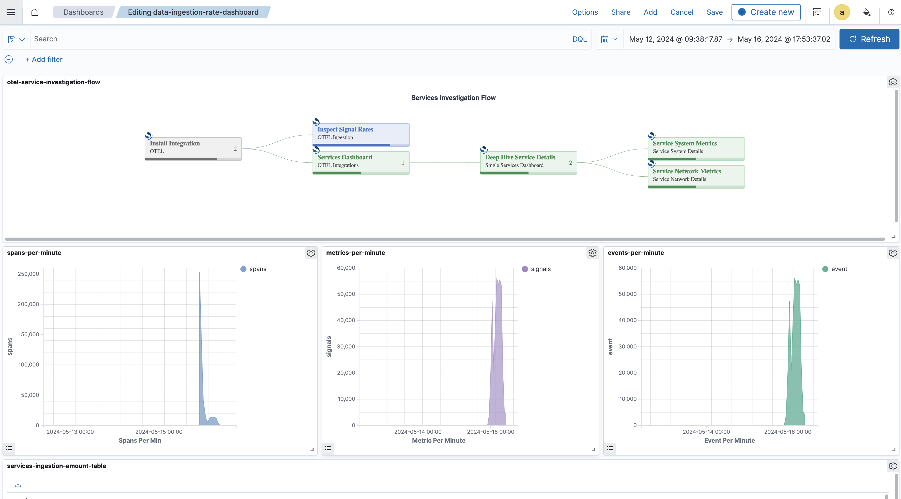
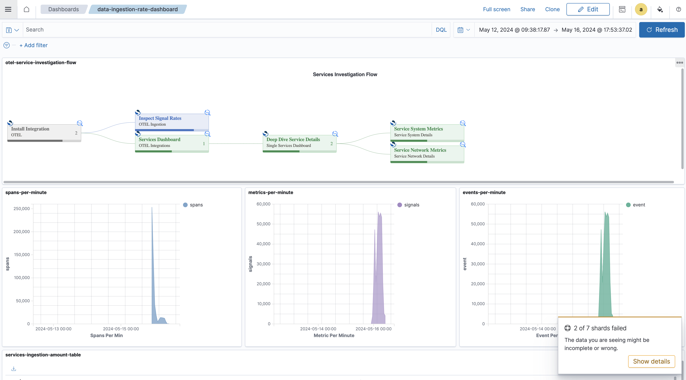
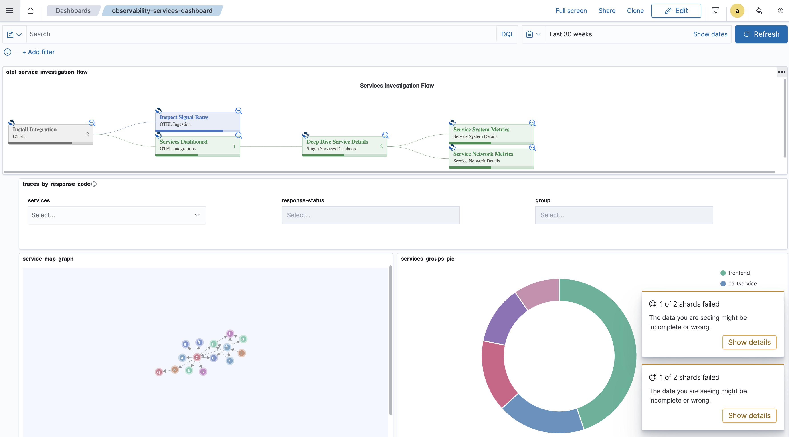
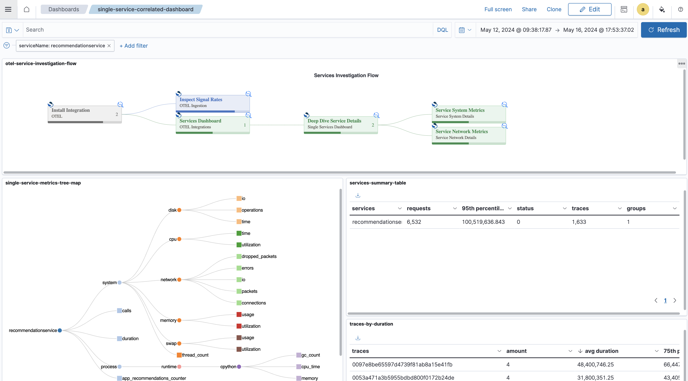
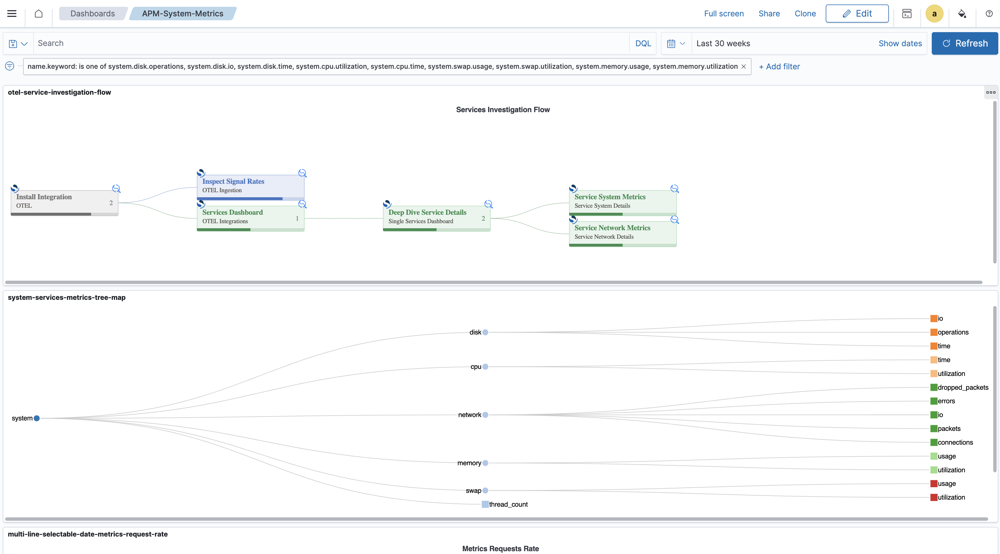
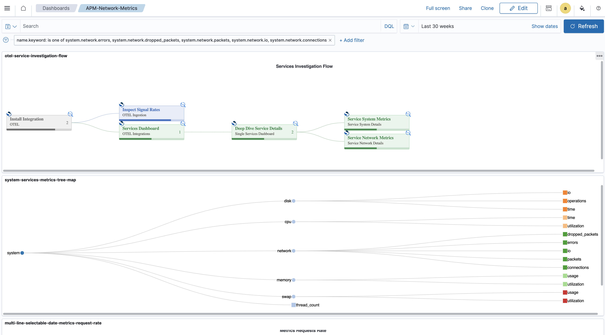

# Otel Flow Use Case Widget

## Introduction
The Otel Flow Use Case Widget for OpenSearch Dashboards uses Vega for complex visualization of Use case user flow interactions.
It's designed to map out use-case steps and associate them with specific dashboards and allow filter carry over to drive the flow ahead

## Info
This widget graphically presents flow diagram interactions, showing multiple steps - each one has a description and a linked dashboard.
See additional [instruction](../../vega-visualizations.md) on how to use and build [vega based visualization](https://opensearch.org/docs/latest/dashboards/visualize/viz-index/#vega) in the dashboards.

The flow data arrives from the OpenTelementry collector pipline which exports the signals into data prepper

## Vega Integration
Vega's integration allows for customized, interactive flow creation, enabling detailed visual analysis and linking different dashboards representing steps in the flow.

## Data Model

This vega flow component is build using a flow specification which describes the different steps which compose the flow, in our otel example case,
it has the following structure:

**1) install OTEL integration**

This initial step is documentative and is focused on introducing the OTEL integration component - it has no use case significance.

**2.1) Ingestion Rate**

This step (dashboard) shows the 3 signals ingestion rate (count) according to the data-prepper's ingestion sink index name convention.

**2.2) Services Projection**

This step (dashboard) shows the high level services perspective of the OTEL demo application and allows users to zoom into the traces, spans and the service's relationship graph

**3) Single Service Deep Dive**

This step (dashboard) shows a single service perspective and details that service collected metrics, trace duration, errors and requests count

**4.1) APM System Metrics**

This step (dashboard) shows a the Application's Profile Monitoring aspect of the service collected system metrics that reside on OpenSearch (collected by data-prepper)

**4.2) APM network Metrics**

This step (dashboard) shows a the Application's Profile Monitoring aspect of the service collected network metrics that reside on OpenSearch (collected by data-prepper)

## Navigation
The flow widget offers a navigation capability each (node) step into a dedicated dashboard including the 
existing carry over from the current dashboard's filter.

This feature is using the `"href": {"signal": "datum.link"}` vega url navigation capability.

Here is how the `link` field is structured:

 - target URL: `http://localhost:5601/app/dashboards#/view/single-service-correlated-dashboard-1_0_0_ID`
 - target dashboard (navigating using dashboard ID) : `single-service-correlated-dashboard-1_0_0_ID`

## Prerequisites
Required dashboards: 
 - `data-ingestion-rate-dashboard`
 - `otel-services-dashboard`
 - `single-service-correlated-dashboard`
 - `pm-system-metrics-dashboard`
 - `apm-network-metrics-dashboard`

## Try Me
[Open the widget in the Vega Editor](https://vega.github.io/editor/#/url/vega/N4IgJAzgxgFgpgWwIYgFwhgF0wBwqgegIDc4BzJAOjIEtMYBXAI0poHsDp5kTykSArJQBWENgDsQAGhAB3GgBN6aAIwAmACwAGGfBpksaDQA4dITHQA2cNCADKcAE7EaUOBAAEASXGkIFigsJDwAxSzZZaRAkBkw2CBoALxt0HCQFKLSFBRpxMjQBGQSycSRLCDQAbVBShBS5KOIyhhSVAQBfKRqkOtsYRubWjq6QWvqkCBw4KEwByxa0TEcWzu7e9AgENjZlGSb5lKWVkbHbMv1JPcHbawAzWdXRnvqmCbhLXJsrg9s4nBBHqd0OI2Ao4AB1RS7ED7BaoFQATi0gOethBYIAEnB9IZvnCNMM1vVSI4LFAygA5UFwADiSH+eNayJOqPQMDYjiSEkwlOpdIZMOu8O0KPWIH8SFJuTIABE4DhobDWjIJFVQHBSOJMBVUKBMABPKa-Gh1RxReiOHaYaxoZkgBg4BRITD1AC0KgBAF1RfV0V9BT9UGZVahqiANXAtTq9Yb6hZTeaYJbsDb4XaHU6XbYtF6fWjqRicR8DLNGbZKlpPVEQ2GI1G0DGjegtgwIHA2CSoshHABrIGjakAmQZ531HDzKA9gAUSzgcAAguI3P4ORApwByWdwADCZSgEHXUg8mYYCFYCgAlEf14p1xeh+rNdqG+ZY7YW222LEh-bHaPy5WuYsmKNAQAAogAHmk4hghkZZBiqkiho+kbPrqr5NiAUAfJOXaSn2rIDmCP4jlm6AnmesA0JYCiOJGHgAHweFoHgAGSsR4uSZkgG5btuOE9nYcR0QACk4CCHh4N4KJJFGUFRNF0eIXgKBAFaeheAD8RxwKgtxlG2QFErYEGOEgeT+qR9QVke8hKDAVZ5ug+pmRZURWQBR56CWjnAfUCgRJcAZwuIDCWJYiFquGT46uYX6wJGcG-pmvphZYD7RahsUfnAAWyOIR5xAwsASqS7l-mRIAQfqU73u03p+SZUAMGa8GheFkXIZl9bNl+bZ5QVHhFSVPKkoV8XwDB5UpbYEA4XAU4QQFCB1Q1xnOc1rXBSk7URSANYoT1IA5QN43FTApWYGdCVTcOFX1HNrgLfqy2rU5IBgpYPJzHCNmVp1tYxVFYgtW4tjyDBETmm+vWtogHb+lAEgQKehzLHAMhMHAmCyHOSFhgamEnYFGUg44YPoBDeXQ0TfVwA6RkYXGE1bKQURI+IKPrDpMi3NRLpmugdaYJQw3wBAlDWHk9AeAAvPLHgevVd0zeRgUeJpHiVAN6muhBtVHjrKieq6NUXp6HioFrOiAfV73mbAHI-Skf2egDh1oXI8DvNN-7oJUuQkpgG4QdAZRwJJ+sXlenG+E4wfrvqYfWJJZvmxlwvRkzvwTZdUR819Ti2MLosTe4kuRmQ9Dy7Lagkfd5aLct6keAA1B4S1sAglTGxeHgEB4ahHlOL1dy37ej93vf94PjlrU8YoQXAEGlslfsgDZdn0L560gPqy+rx5-s6N5WA7wv9SJNsCDO6o7vdZ7sje5YACE+cchTPNr5VOARFOKiUC0FoFQR4S6fR5AATQ8AAKg8L-WQ-8ABsoCnyUHAUgAAstSaOGcgboWKKUdK5FQKYDrp0EAtwP5oxaCrdeOR-AqBnvQ0hjN+zMI9PBYM+MPZZ0Jszc6edeb8yLkLVBYty5SyrjAGuZDaE-1yLAGUJCHYLWFnVEYmcXwELKLYZhsjv7+RIWQ+ebCjG3wQvtbhD9eEwziudVmiNkao0WOjIRhdBYP1LudCRldq7y30UfEAOAFEwCURKJcqinxvUaugTuN85EPXmotA+9576aPwRcHR5F3jfXIYEyoEFNrjw8JMcyi1Np91gegluA8t4wCPIUlqPcLbt1KeIcpLVKnHhyUgGpHg6nn3SaAbRRCQBXy7vXVWG8HbskcMUpuY9KweFdB4GZHJ1JdPGQgI8ay5lLPbgsqeFsVm7I2TAjwWzBl4I+kwSw2FXA9l9pVTeUIHKsMIpPJ5iSnojxSdWKxQzxSZNGegyZ69Kj6iKfskp0ER4VPOdU42M9T5XQ8JCppSLWmwvRY4LpiKLYDxRVcrKWjgW2C2WC55pzMUeBHs3JZJylyzOaZs6+OymXrJpXSseSLGWOzmdPWBlzcEkvIrc+5uEEmeSJe8sUydcpeAQGQcEXzbBTlkAPNphzo7QLqRlfs8qFCKrIBiVV6AkBMDXDATV2LXoXmgSi-VhFDVUjBJCeyZqQBTj9O6+gNqylxJ1Xq96LqCzYhLJ6i1a4-RYhxJgf17TJ46sdSG8k1gFAhG5CoAAzJ6-+2aE3avtcGmJ4o025UzVqdQeb1CFsDcW15Tq5XlozVmjhBi1UqBUHWu1urG2pvDgoAA0iJLwsaI1SvQFOAQPau5Bv7aWw1AAZE0dA81qC0LOlaDaPXKw+s6FAXUDVfnJv6JUOowzWFIJYD06AADyAAVMCS6ohgh5NRWKPgJThW8FqcgZkghBVyJQl8x66geFODIME0BOQKnYEhD67goCwcA1EOitwnCRmXLopDKH4MkUcKMrAuBCAEHCGm9k-hUACEQcAgg9IcAEFyC6MgAH4MQAAMT0aaNRC11gCA7HeK6NszgnoVBkD2YJaAADshIQBXveLekAj7n1RAU5YOu96n1Lt-WQdwqGoPYyQB+2wX6pgzA8HYYFHgABKo5xMgGA2wUDzqu5wAg6iQzMGaBwZDIh7zvmgrocwxE2K0HkM+dQ3kwjfRsA4FI+RsolHMDUdo92hjBAnQQBgEwNgkpVJcZcHADV3FXTSn0-B10AG4CuiyzlvLjgFDugAPpaFa81rwMooiSZoGgUwjx1NKZUy+mQ6nNPKe07+ljbHkavqMyZ9ADhRPLg8DKCY9X8vuRi2yOLCW2AUfiClmjdGMt1dy-lzjJAaDFYEy6SwwmnAuGXLV9b53Gstba21zrUQnMublW5jzvQvMRcCzhgLBmQDBaUth7J4P8PkJ6wUZkoBBu2GG2piMGm0eTZ8NN507GMfXtzYt6U1hLOPbE6t17DWkpvuM+UWwcp5SrZoKQcny33NynfQzmQv30Jgfc5B-zIPUOw5F-hmQUOsPuDB+L1U0WiO7aIIlywyXUsnZwIxs7NPLtFY1QkPI1gHsc9dEjRwdFLCjia9r-LH32vfYk1J6jyP5OY6G9pwn7xxvDam-+-Hs3RuY+J-YUn7mltPfcFT7Lb2krqY0LYcPT1LNJxdAgVb82eeIe57FRPbhk-+EQB4DB2NOT7i24rkjyv9tJcO+r9LmvMvU4u4V67Gr6QIGEynxAro6hLFcBAF70ead26+113n4gQP89c+BoX4W8N+bn5FiXkO4AYehzLsX8-JAI6dwIF3qOtOqcD9e73OO-2sf95zT3lhg9WcN2HinK21tD828f948fFuP-cxSbGsgOQ9nT2zx+wn2cyn3+xn082Fy31l2gMl1XxCxhygKX3l0MyAM-w5w8B-xxn-yLxL373L1i0rzI2r1V1r2O3ry1yb0a111b3oxwA73EF-3-x7zwP3EHw23exUHa1H26132RBMUIjsjgAfTYAfTKHSiKBPQpnFCkP9CWHMggEoUcBvi6j4VsCUIQDChQBkGXhwA8WAB7DgH1CtjkkGykDSCUhSwgzSkNgz3wDkjpw-SPB61QDkh6yPA+HEB7FcOdFPEoBagiljkoR8MwD8Kc3aCiAmBuCVhGDUPQA0K0KiF0P0MMOMOPF8LPEG3bnXAAB91xW5TDMch4LDUITCMiK5r0QFuls8Qi-DHDyhnDglaizx3CPBPDvC5IAijwnNmjWAQCIiZAoj0AsdHg4iKEORNDLckioIUijDejBs24pI8iCjyixtsjljCiidzDJRSj0jQjMi3d1j8jNivdbCaiHC7DGiaBejWj2jeiuigi2BejwjIjYob8MoxiEipidCZjbADC5iTib1FjcjjjViiijiVj9iKj3hs0IS9i-C49tjLCyioSFiITAS1B0SwStjqj6d7Dyj6iIAribjgkPDcgOjyiHiei5IXjBi3j49RjbEvjtDwxfj0B-jjDATGEsTUTwSljQTeSic4TASNBhTsT3hCgSitQUSES3dgSNjxSNMeTZShT+T24RSzi8TejCSySvD7jCNuiQDniQDiS3DgkBjog3iBAPimSJjEifi9C-jUj5i5TlSDiT83ToSb8xTBT38fSVSJT-T3T3hkEpSrCuT5SBSAylS1TATYS1T4TgzLBRSEzATChcSP1tTLi2jyT9TAjqTyinNTTyiesLShj5NEEbTMJKEaJ85rsaIL15N20sdRtc1Rt49RtrTRtKz54xi9C2BhBphV4+Z3hVIqgQBUjb5ezbTlD7TWTHTyJyilRKBJy6TbBFAqz6hmTpiFyV8SQ2wpxJgPhg45JlzUipAQTo51JXjjRrQbBGTqy7Tvj5yPFTzBhKAwybzUgditRNz1DhEtpkjdFyiLA7yPAX5ZYpJdp1w2IOI5JQKycIKpIGAYJV9PgZI-zzUyBWM+AswZBWMvwcAmB9RxyNyZBPyZAEKz1rhpzHzZznygLFyoTlzCSvys88TMLxj6KWTGL91mL3zEc1z0BEcHytynyeK2S+K-Dlz2i2LZLRL1DxKdzXylz3zfshLHMQDZU4w6Idw9wHMyZpChCRCxDwpzRXJFCJiooxj-A2NbgSKJMjD1ykowyh0nLvzLDOKtwuxsZ2QMgMkSgskQBNxFB9R1wfw2wLDL9SVArRl9Jyh7yhLKg94ogII5sFR+gZAFJaJIwQB55yyKLs54ilKHSVKoTPy7ZS0+IYBqIcqgpDKdK5xdw7kHN5DOYNDrLbEkBsK6JAh-QCKHRiLxzPy3YKF6yxzQwgkfzZhRq2A8Bxzz08qkqsIarFJIw70mBByZgKhaKxLuLlLbBxxippw5JsqlINqtrtQLzbxUlLTbAzrIwVIKhKrd4txFxlxhIDLZDfhdLmqy9KKLKOrVCZzJiWTyy3rQtPqDr0AIaPrVxeJfr9LZJCyFBrxLQdg7xOLbhLdsBcqhFRzGzYb9NVw8qFLir9rSrgKoSiaVxHAJZCryzxCRJprnqBCxRqraqlJ5wzLJDQZGqFxIaSaAaFCgaCZbF+zLq6yCbxymaWafskohdCq0qZAHLEMMr2ZVq6rSbYiuqercL-QRyGzhrprMgTbecMhZr5rJrFqsqvxfyZAEBcglqQABqiKSLJrZbLCdrlrxDtxNbzrNqhyHNfb-bIxtw7bV4NzdrFKKaXzDqJwTryiQ7Ob1rA7trrqZJbrGbwo-aU7lIxyXqL4fqmqBIhIORhDEABQGri6Ba4a6bzKRarLgbMIJahypajbJqyKi7yKzaqoohVawR1asrQ7JBo6sKcK+r26Jrkqo6VQrbkrHbR78LLRBr3aZ6FbIClb+70roQHrR7C7+w+JS7hI4AxJlDnYL1ZqrE+9sKRFxRRoLA8g5QMqGJZYcxx8RNZgmKeJNxfrj7y6H1K7MbRjORb6PE-RgDP7bAX5QJIJoJYJNZuIEaS6Hky66JAGEAcA7w9IDJEq9RQG9NwHBw4CHF1zwIoJzIEGkHf6UHJw0GK7MHsH4rDID7CItwl0kB9QvxV5q7KZFBhDRDxCG72qm6xbqyALobNLqGj7UGT6z6JJrxbxDYUb1FGwHp5CLB7Lut3LHMXLpq3L3aprPKybzBdKfL6BQQYrCFbAQqFAwqfw-QrNkhgYyVgQw041W4g5XBeQwR+RSZXGiIIRXlW5ZkuQtQfHaR6QvQih5RJRoqArrH4jcGfwhjkrVbla1bd6R7ta1GY7QbJG5J9RW4pwUUCA1As7YoSKTHtzKaNhy0Q55VDw5IIIKmTJDUsaSq46mKwitKNLftqnOneLTDyS5KRnHgCre7PjBnJK5IKq2aty0oH1dKOGuHvxebT0a6VnuHhHLLz7m76hwg2AewGZeZLQVDTGmrsnHLDHCrDbp7dHnbFrJq96Lqg6Na86nqcmir5NthjmBRbgzma7c61rxBuaJCJydHPaSV8aO717HnBhGzk6QXPnBic6R7XntqvmxjDm-n85AWYbEaWrtHDGu67nGzZ7tpGy96sWQa5zeK6J9yFojrJwZxdL3ria6bkG9KWrkaoTFAY5pI7wLxmk2KtxmbjH5nbAXAEhbk4BXUZd1npDbhFnlnOHtnhaRG9mxGtyJHampGD0uX+JZHy75HJJBXlG+XLxtL3wkAIJfUYBFwFBx1cQZC+apXQIaBZX5XWrAbRHcnx7er-xl7CKhrJrB7lBRqyXxzw3Mq+6Vbna5qqWI68IMnkA0rRrUmsJk2ZAMmSKx7og9bJ6YX7mY32Zs242UrLbGy02U3a2HbbXnbM203n7oQ03vWU2AANFNiBUmyV4Y8kr6t1glucLZtZ0xxurV-1i594Adzi9otIaEDka7X8tkJdq+cJ8F7LekQxbqiQHRRVuAHt9CXi+VDcJOctXlvwhqygfUdRV109Lt49yS099cUOC9i1q92QygCCVuH1V5O90aPTTAI99UZ9+pxORpj9s8QD7GG9gDyUIDx90D3cl9t98OS96DhD2DlpgEap3VrpkAWOaRv+410ScSM1pRxM0WLDkWfl3MUa+VC9XeNDm0GQZIS0NAZhjGD6LuYzJCYZAJuJH8VyPTKxoK0ycyUT9od6c98OKIdj0ArjqDXjp2hJoKz5chETlIAT2K2wFyST+896HreVeTpwRT3B5T5AVTmyFQIBUarTsT0ZGyUNN1V5Ryd6JGcIFqGmeoDkHIaxyXAz8cjjRBW4UL0LqIDjDQDQaTNQbcDskADjbNecYwMCPfSLsCGUaTGUbNdtDjJARBbNBEIryLwr7NYwAryL8rjQbNSrmQJLirxBBEa00a5aPjl8bid1mV6wdt4tmu8V1CXD0a7sHsJj75hd2N5jJwJAGYVnFIJTihfF0ATr-trw56nQpcQcdCI+UACbl8O5w650fochWyo5oJj1NT0ZLiZeNgW4b1AsIsONKD6jxwID88C8Jid0TWNQSgAQIMSgBkooJYM7rRcte6tgLzraEZWwBlpwA85l6cGmz6w1pG57mD2jy8RRzO4V42XD6T0tCB4HaA9AB9eAOBaaiDYh75129mD4f4HBhK05iZdCFbmED1r16kdb8MTb4ibbhudCNK9CA72JKIEz2JEz8hPVS72aFteV+1n8SFfb8avT0XsH5yCX3QcNQwaXupwdeV51h4NxIhHTxJ46JwPTEpuaQ88Dzzk9DD0WXSgbrUaOI8YASwf7hEDQdoO907wwxz98c3haC6Swa38ODcW3lqe3sV6al3jwN3-76TBEb3n8M3RgxwOzHIVsF8JUNANQchTaMQQWE3oK06kehiLQTSdcX+KbxwdcVAdccK8hOICHiwen4v0ZPH+t3sMb-sdoxVbquQ2xE0Af4AgWGbiwNmVAL+LDLb9UP9Iv+0bbUAHPnbXAfAIgVwZGSgEkfUTf8QeSLuAgHAPIATAgXKYqS-V0F0WAEEcIMgfUI-y0BQYqTAMrDmV0W710ekUqV0JgfQF7HkAJimCcw4AkoWAL-wOAfk8guHSdKADmozc6A7tZfkKBUDkJBe7fTtKYC3Tzpd08bHXiAHdA5hJejafAYamNQqpyEjqUgS2mNSmpyEEwczF-QwHmpJgbdE7lsB2D9BSBHA5QPQOLD8cgUunc1PwJ-CvA2wnhbToINN5iCZ2jBH8M3y+g+Z-eHlVCH0RAz48MACMBfvAKgCIDs+QoLQL92k749d4TmfvqJ0opD9kAFgzSmP1m6T9p+PPSQahBESgAAi+gwMBgDizr8gBkYNsGAJgCUAOQZAejBADbDagCATAVyAoAIB2AAAajSAIAYJ8IvgkAQEOawjdmsYIfSGFBFgQBiA+QDQTtwwDoZlBRjVQfJTnoICDQHguEKgJzZlC6AiASgCN2oAr0cA37GIilXwGECfwUvZgWWkHTkCfwVAgYWQKVR0C6SjAsoQwLYFFAeBXAsYQsJSYiD8B5wEoKILeASCyhMg7YRoPZCdh0IOgvQehBX6GCOgxg0tDVQMDFgXWi+UHGyEe4lhaUbYRAJ4A+CGFVkHgOIXwA8BMAGAZAVZJ4HoCgRjwbAPwZuH6Q4Fgg9AdzK7Q8DvBEAqEW6mMTogzBR+03ewfNws7c8kYvPNwfz1ADoCpBQVJoWeFaGu1OhCvMoUQKN6NDUKEEW7vd0xBPCsAR4MMu90+4qBNYpoC3sH1D7WBw+EPO3uyOmoO85wTvTALH3j6GDjAefC8EGAirA8-e+A67oyLu4xpWRqKDkfyy5E8jA+lvEPi+wj619RRlhcUafRj4xwZRlARPt70VGUCteTAkkVd1TwtD8IbQwipQBTQyB+hLo9cm6IpHtDKAwaS4bvBHReA-hM3HsANVuhIEHhIACMVGMnCxikoqItuuPjsET9sRjPLCHTxcQ0JcRs-DtAL0aGBiPRlIiCF0KQH+j0AZI90b2E9EOhvRTo4TC2gjEG8RhTosoYag7HdjiBF3AYVOHrFBivRdSO9gXGN6DDUwWbSHqLwCYcjo+xjKoboJqGnCDBlAPPmGKLroAIxc2OHH5j3GWDMIaIyOvP3H5zdOOOI+5PT0cF4jJBxQ4kdDzrHljGxlY6sWWOaGjjmxKKNsYOj7FxouxgE6gf+NHSdiBxygECYKPXDGd32HInrBOOohTixes4k9POKEHlCtQFoyUXjxMYugV4GIsyFiKvG5j+wQuGfviJLFEiyh-8TdDCgDS9oS03QocYgmwE7peBvMbkOCG7HrjPBtGWkSAF2GfBahzMf4OQknGg85O6AE0ehNN6LjHeJtJvgfDKEcjWK4k7kE40kHPjpxFaLNLmnIQfBHazo7SS53O70A-x6aFdEZJ-CUIV2yAzwc1U9achcJOtTCPhLPFZjLxDPNsDIEPpWB-QFEh8YSL7r4DaJbEvtLgOYm1ivUagNQOFKYnrCBBK-V3PcE2HiDhJvEuEHFDEl0j8B64KLjKA0AAAhaLo30orKT8Bi4-yTZI0lJAtJATQ1JWkwBdofwhktdFBNyhy9XkFk3KFZLXTqS7J20WwI5KiG9ZjBeE5SZmMxHZiSJPkncYEw8DUsNu94l8I+M-HkiKxwYupMslpQIh4pC6KKdpJHGbSvRpTfRIlJEkw9AJ5CISXIMyn1BHa2QG0OJKQmSSZxMkooAuLFFLjBuSkgiZVLFF71y+mkDkXvXr5lTxiWoTST2JbRNTq0A050clJGnOTxp3ob0EAA)

---

## Acknowledge

This widget was originated & inspired from [Deneb-Showcase work](https://github.com/PBI-David/Deneb-Showcase/blob/main/README.md)
